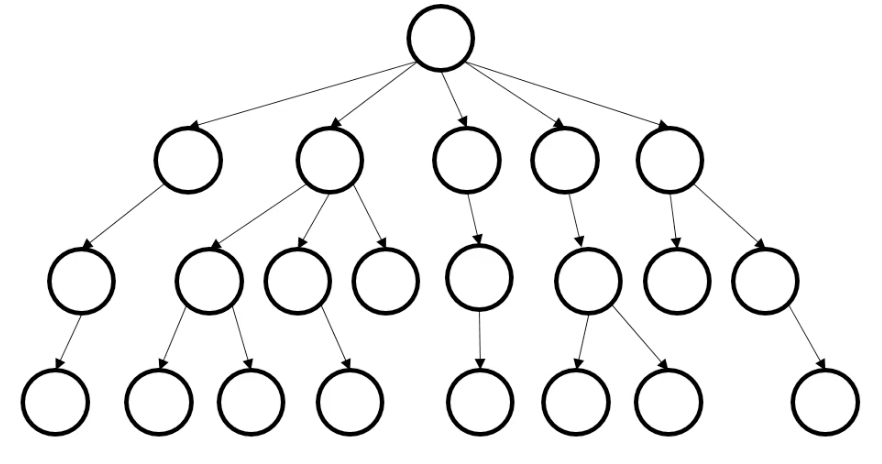
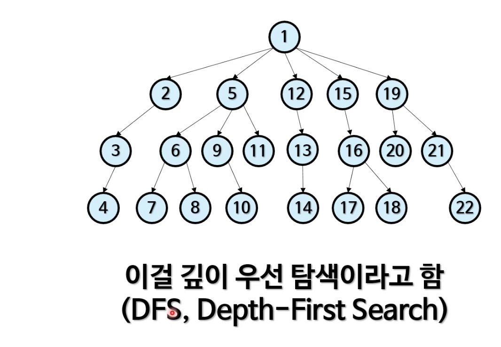

## 트리 속에 있는 데이터 찾기

* 저장에 특별한 규칙이 없고, 트리 속에 데이터가 없을 수도 있는 아래와 같은 트리가 있다.

* 어떤 순서로 방문할 것인가?

  * 알고리듬이 필요하다..

  

## 전략 1. 한 우물부터 깊이 판다.

* 한 우물부터 깊이 판다.
* 왼쪽 대신 오른쪽 먼저 탐색해도 됨
* 중위 순회와 매우 비슷
  * 따라서 재귀 함수로 쉽게 작성할 수 있음
  * 비 재귀적으로도 가능 (스택 자료구조)
  * 사실 깊이 우선 탐색 기법 중 하나
* 간단한 '미로 탈출하기' 전략도 dfs 로 구현할 수 있다.

## 깊이 우선 탐색 코드

