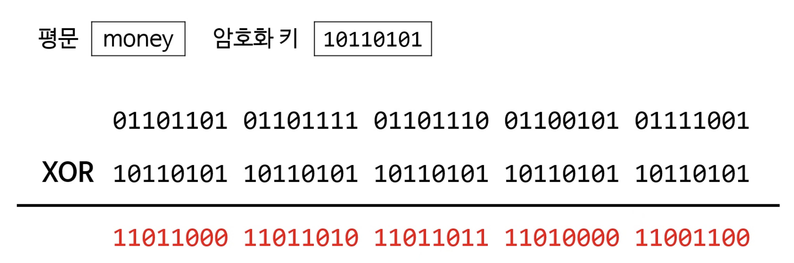

### 암호화 (encryption)

* 평문(plaintext)을 암호화(ciphertext)로 변환하는 것
  * 평문: 누구나 읽으면 곧바로 이해할 수 있는 정보
  * 암호문: 읽는다고 모두가 이해할 수는 없는 정보

### 복호화 (decryption)

* 암호문을 다시 평문으로 변환하는 것
* 암호화에 사용한 방법을 알아야 빨리 복호화 가능

### (암호학적) 해시 알고리듬과의 차이점

* (암호학적) 해시 알고리듬은 원문 복구를 막는 게 목표
  * 고객 비밀번호 정보 ➜ 해시함수를 실행했을 때, 똑같은 해시 값이 나오느냐만 판별하면 됨

* 암호화 알고리듬은 원문 복구를 허용해야 함

### 정수론 (number theory)

* 정수의 성질에 대해 연구하는 학문 (1,2,3,4,5.. 가 왜 정수인 지까지 증명하는 학문)
* 컴퓨터 세계로 오면서.. 2진수도 정수이기 때문에, 2진수로 표현된 데이터를 암호화하려다 보니 갑자기 주목 받음
* 특히 소수에 관련된 정수론적 알고리듬이 많은 주목을 받음
  * 암호문의 패턴을 들키지 않으려면 최대한 공배수가 없는, 겹치지 않는 수가 필요
  * 소수는 자연에서 가장 안 겹치는 수

### 암호학에서 사용하는 정수

* 매우 큰 정수
  * 흔히 사용하는 32비트 등의 정수가 아님
  * 32비트 범위 안에 있는 소수는 오직 203,280,220개 뿐 ➜ 브루트포스로 충분히 암호 꺨 수 있음..
* 입력 크기 N
  * 알고리듬 문제에서는, 보통 배열 속의 요소 수를 의미
  * 암호학에서 사용하는 정수에서는 비트 수를 의미 (N이 128이면 128비트)
* 곱셈, 나눗셈, 나머지 연산의 시간 복잡도
  * random access machine 에서는 보통 정수는 *O(1)* 의 시간복잡도를 가진다고 했었음
  * 암호학에서 사용하는 정수는 비트 수에 비례

### 대칭 키 암호화

* 암호화/복호화에 동일한 키를 사용
* 이 키는 메시지 송신자와 수신자가 공유하는 비밀
  * 수신자가 이미 그 키를 가지고 있어야 복호화 가능
* 송신자가 수신자에게 비밀스럽게 키를 알려줄 방법이 필요
  * 다른 사람들은 몰라야 비밀 유지가 됨
  * 대칭 키 암호화의 가장 큰 단점

### 대칭 키 암호화 예

* 평문을 암호화 키로 XOR 연산을 한다. XOR 연산 두번 하면 다시 평문으로 돌아갈 수 있기 때문 
* 암호화 키는 서로만 알고 있어야 한다

### 암호화하는 방식에도 2가지가 있다. 스트림 암호 vs. 블록 암호

### 스트림 암호

* 위의 예는 스트림 암호(stream cipher)의 예
  * 한 번에 1바이트씩 받아 암호화를 진행
  * 안전하려면 각 바이트에 적용하는 키가 달라야 함
  * 블록 암호보다 설정이 복잡하나 속도가 빠름 (단순히 XOR 연산)

### 블록 암호 (block cipher)

* 정해진 블록 크기(예를들어 64비트 이상) 만큼의 바이트를 한 번에 암호화
* 각 블록에 사용하는 키가 동일함
* 스트림 암호보다 설정이 간단하나 속도가 느림

### 우리는 일상에서 대칭 키 암호화를 계속 사용중이다. - Wi-Fi 비밀번호도 일종의 대칭 키

* 카페 갈 때마다 받는 Wi-Fi 비밀번호도 일종의 대칭 키
  * 공유기에 설정하는 비밀번호와 스마트폰에 입력하는 키가 같음
  * 스마트폰과 공유기 사이에 통신할 때 이 키로 암호화를 함
* 따라서 그 키를 아는 사람만 메시지를 해독할 수 있음

➜ 그럼 카페에 있는 모든 사람이 내 메시지를 훔쳐 볼 수 있다는 것인가요 ?

* WPA2-Personal 은 이런 식으로 작동
  * 스마트폰이 처음 공유기에 접속 시 교환하는 어떤 값(예를들면 기기고유번호)과 비밀번호(모두가 아는 와이파이 비번)를 합쳐 키 생성
  * 그 키를 이용해서 메시지를 암호화하고 복호화한다.
  * 따라서 모든 접속자마다 다른 키를 사용
  * 하지만 해커가 둘 사이의 모든 트래픽을 캡처한다면 읽기 가능
    * 처음에 공유기 접속할 때, 기기 고유번호도 알 수 있기 때문에..

### 대표적인 대칭 키 알고리듬 - AES

* NSA (미국 국가안보국) 에서 일급비밀 용으로 승인한 유일한 공개 암호화 알고리듬
* 현재 가장 널리 사용되는 대칭 키 알고리듬
  * 앞에서 예로 든 WPA2 프로토콜의 일부로 사용되기도 함
* 블록 크기: 128비트 단위로 암호화 ➜ 블록 암호 방식을 이용
* 키 길이: 127, 192 또는 256 비트 ➜ 내가 설정 가능. but, 암호화 단위는 여전히 128 비트 단위로 암호화
* 키 길이에 따라 평문을 암호문으로 변환하는 라운드 수가 다름 (평문을 한 번만 암호화하는게 아니라 여러번 암호를 돌림)
  * 128 비트: 10라운드
  * 192 비트: 12라운드
  * 256 비트: 14라운드

### AES의 블록

* AES는 한 번에 16 바이트씩 읽어서 암호화
* 16 바이트를 일렬로 쭉 놓는게 아니라, 다음과 같이 4x4 행렬로 배치

* 그 뒤 여러 처리 과정을 통해 암호화를 진행

### AES의 내부 연산을 알아보자

`James is the killer!` (아스키, 총 20byte) 를 암호화 해보자.

* 20 byte 라 한 블록(16byte가 최대이므로) 에 다 안들어감 
* 암호화 키는 어떤 128비트 정수라 가정하자. (이건 중요하지 않음)

* 첫 블록을 암호화하는 모습을 보자.

---

### 출처

* pope 자료구조