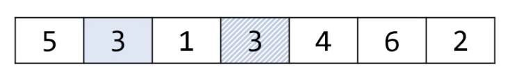
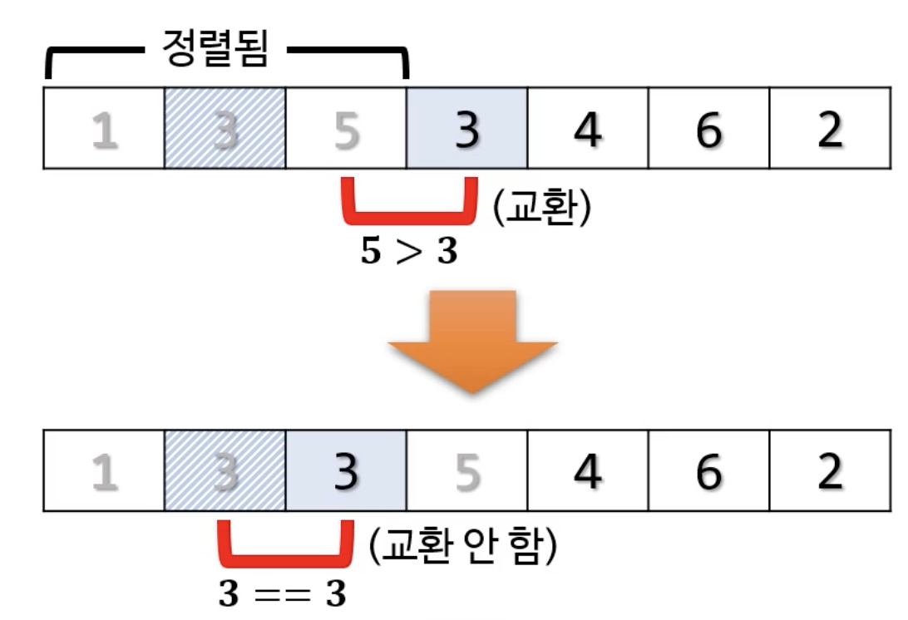
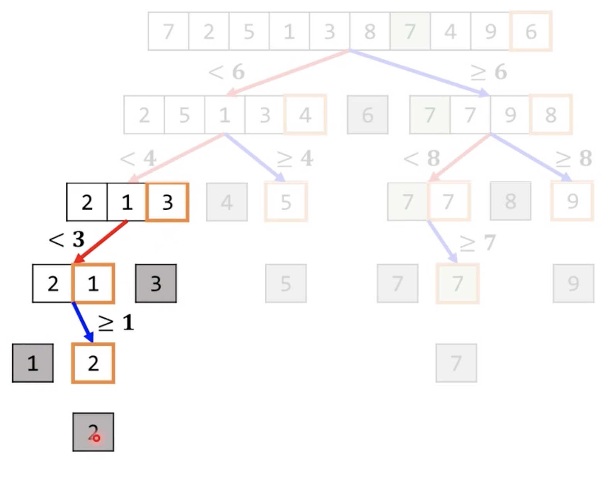

# 1. 정렬 알고리듬 비교

|      | 평균       | 최악       | 메모     | 안정성 |
| ---- | ---------- | ---------- | -------- | ------ |
| 버블 | O(N^2)     | O(N^2)     | O(1)     | O      |
| 선택 | O(N^2)     | O(N^2)     | O(1)     | X      |
| 삽입 | O(N^2)     | O(N^2)     | O(1)     | O      |
| 퀵   | O(N Log N) | O(N^2)     | O(Log N) | X      |
| 병합 | O(N Log N) | O(N Log N) | O(N)     | O      |
| 힙   | O(N Log N) | O(N Log N) | O(1)     | X      |

* 실무에서는 퀵정렬을 가장 많이 사용한다
* 퀵의 경우 재귀함수가 사용되기 때문에 스택 메모리를 사용하는데 O(Log N) 이 걸린다는 말

# 2. 정렬 알고리듬

## 2-1. 버블 정렬

**버블 정렬의 시간 복잡도가 왜 O(N^2) 일까?**

* 이 목록을 훑는 횟수는 총 몇 번? N-1 번

* 한 번 훑을 때

  * 가장 많이 방문했던 요소 수는? N-1 (1회차)
  * 가장 적게 방문했던 요소 수는? 1 (6회차)
  * 평균적으로 방문했던 요소 수는? 

  $$
  \frac{N-1+1}{2} = \frac{N}2
  $$

  

  * 시간복잡도 

  $$
  O(\frac{(N-1)N}{2}) = O(N^2)
  $$

  

## 2-2. 선택 정렬

* 최솟값을 찾아 선택한다고 해서 선택 정렬
* 프로그래밍을 배우지 않은 사람한테 정렬하라고 하면 대부분 이런식으로 정렬한다. (반 친구들 키 오름차순 순서대로 세우기)

## 2-3. 삽입 정렬

* 외부 반복문의 반복 횟수는 고정 (모든 요소를 방문하긴 해야하니깐)
  * O(N)
  * 정해진 횟수니 *for문*이 적합
* 내부 반복문의 반복 횟수는 가변적
  * 필요한 만큼까지만 오른쪽으로 미는 방식
    * 시간 복잡도로는 여전히 O(N)
  * 정해지지 않은 횟수이니 *while문*이 더 적합
* 시간/공간 복잡도: 버블 정렬과 동일 
* 안정성: 보장 됨

## 2-4. 퀵 정렬

### 퀵 정렬의 시간 복잡도

* 각 단계마다 방문하는 요소 수는 대충 *O(N)*

* 총 몇 개의 단계?

  * 매 단계에서 좌우가 균등하게 나뉘면
    * *O(log N)*
  * 매 단계에서 모든 요소가 한쪽으로 몰리면
    * *O(N)*

* 평균: *O(N logN)*

* 최악: *O(N^2)*

  * 최악의 상황 예 : 분할할 때마다 한쪽으로만 몰리는 경우 ➜ 즉, 기준값의 최종 위치가 한 쪽 끝

  

* *O(N^2)* 을 절대로 허용할 수 없다면?

  * 다른 정렬을 사용할 것

  

### 퀵 정렬의 공간 복잡도

* 재귀적으로 함수를 호출
* 실제 원본 배열을 고치기 때문에 따로 추가적인 배열 공간이 필요 없음 ➜ O(1) 
* 함수 호출 깊이만큼 스택 메모리 사용 
  * O(log N)
  * But, 스택 메모리라 할당/해제가 매우 빠름 

---

### 참조

* Pope - 알고리듬 및 자료구조
