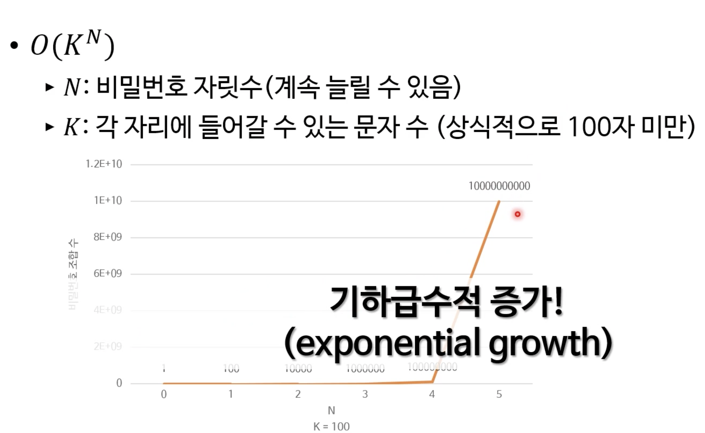

## 간단한 주먹구구식 알고리듬 예

**모두 다 1분 안에 작성할 수 있어야 하는 것들! 전부 O(n) 이 걸린다** 

* 배열에서 어떤 값의 첫 번째/마지막 색인 찾기
* 배열에 들어있는 정수들의 합 또는 평균 구하기
* 배열에서 최소값이나 최대값 찾기
* char[] 에 저장된 문자열 뒤집기(사본 생성 금지)
* 그 외 다수

---

## 주먹구구식 알고리듬과 시간 복잡도

* O(N) 보다 시간복잡도가 높은 알고리듬들이 많음
* 보통 실무에서는 O(N^3) 정도부터  최적화를 고려한다.
  * But, N이 작은 수면 상관 없음..
* 컴퓨터에서 실행하기에는 너무 느린 알고리듬들도 많음
  * 알려진 최적화 방법이 없는 것들도 존재
  * 반드시 나쁜 일은 아님
  * 보안 분야가 이에 많이 의존

----

## 주먹구구식 비밀번호 깨기

1. 비밀번호 규칙에 맞는 새로운 비밀번호를 하나 만든다
2. 그 비밀번호가 올바른 비밀번호인지 시도해본다
3. 올바르지 않다면 1번 단계로 돌아간다

### 주먹구구식 비밀번호 깨기의 시간 복잡도

---

## 주먹구구식 TSP 알고리듬

1. 시작할 도시를 고른다
2. 모든 방문 순서 목록들을 만든다 (모든 경우의 수) 
3. 각 목록의 총 이동거리를 계산한다
4. 그 결과 중 총 이동거리가 가장 짧은 목록을 선택한다.

##### 시간복잡도는 ..? → O(N!)

* 지수보다도 더 기하급수적으로 증가하는 것임. 매우 느림!

---

## 문제 해결에 지수 시간이 걸리면 비 실용적이다.

* 지수 시간 알고리듬은 실무에 적용 불가능한 경우가 매우 많음
* 다항식(polynomial) 시간이 걸리는 알고리듬을 선호
  * 다항식 시간 vs. 지수시간
* 해결에 다항식 시간이 걸리는 문제를 **P 문제**라고 분류하기도 함

---

#### 퀴즈 1. 이 알고리듬의 Big-O 시간 복잡도는 무엇인가요?

> 1. 정수 n개의 집합 S와 정수 x를 받아온다.
> 2. 새로운 S의 부분 집합을 만든다.
> 3. 2번의 부분 집합에 들어 있는 정수들을 모두 더한다.
> 4. 3번의 값이 x와 일치하는지 비교한다.
> 5. 일치하지 않다면 다시 2번 단계로 돌아간다.

##### 답) O(n 2^n)

---

#### 출처

* Pope Academy 강좌