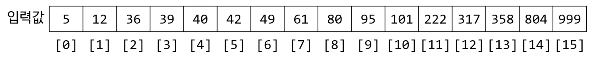

## 탐색 알고리듬

* 어떤 데이터 구조 안에 저장되어 있는 정보를 구해오는 알고리듬
* 매우 다양한 것이 여기에 포함됨
  * 배열에서 제일 큰 값 찾기
  * 데이터베이스에서 레코드 하나 읽어오기

---

## 대표적인 탐색 알고리듬

1. 선형(linear) 탐색 알고리듬 ➜ *O(N)*

2. 해시 맵을 이용한 탐색 ➜ *O(1)*

--- (7.13) 섹션3. 이진 탐색의 시간복잡도 -> 이 강의 듣다 맘. 이어듣고 정리하기