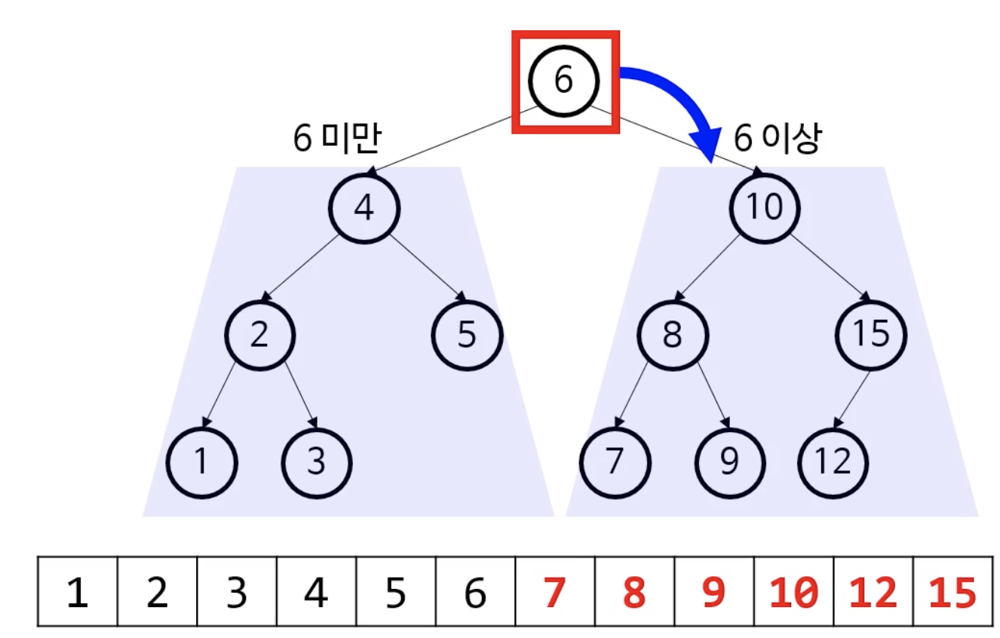
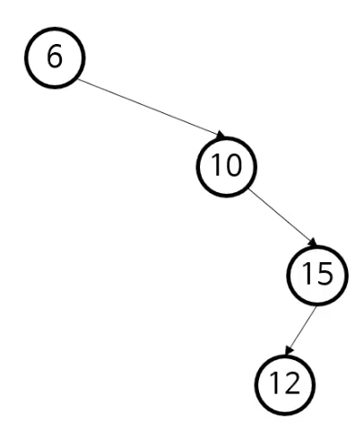
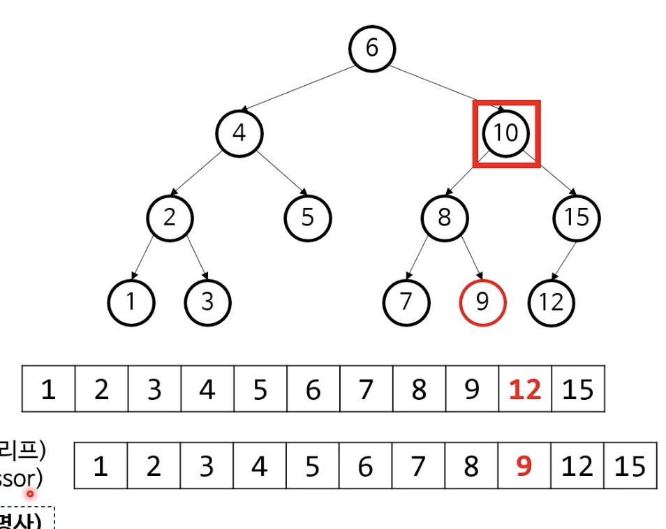
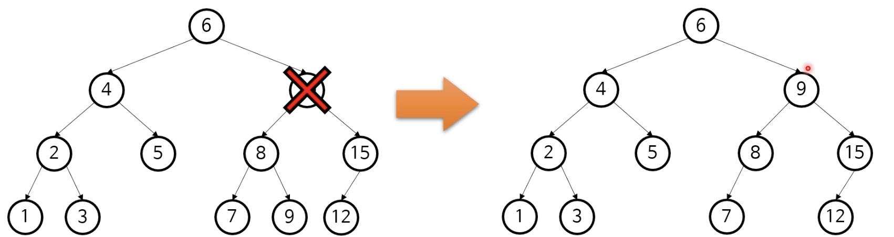

## 이진 트리 ➜ 이진 탐색 트리

* 자식이 최대 둘
  * 왼쪽/오른쪽 자식
* 이진트리는 무언가 계층적(재귀적)으로 이분해 나갈 때 적합
* 그 무언가를 이분하는 기준을 만든다면 어떨까?
  * 그 기준에 따라 특화된 이진 트리를 만들 수 있음
  * 그에 따라 보다 효율적인 알고리듬 고안 가능
  * 이에 따라 이진 탐색 트리(BST) 가 등장함


## 이진 탐색 트리(BST)

* 이진 트리에 이분하는 규칙을 추가
  * 왼쪽 자식은 언제나 부모보다 작다
  * 오른쪽 자식은 언제나 부모보다 크다

* BST는 "정렬된 트리"이다.
  * why? 재귀적으로 읽는 순서만 지키면 된다.
  * 정렬된 자료구조의 이점 - 정렬된 자료구조에 특화된 효율적인 알고리듬 사용 가능


## 순서대로 BST 읽기

* 루트 노드부터 시작
* 다음 단계를 재귀적으로 실행 (중위 순회법)
  * 왼쪽 하위 트리의 노드를 나열
  * 내 노드를 나열
  * 오른쪽 하위 트리의 노드를 나열




## BST 탐색

* 재귀적으로 분할 정복해 나가기 때문에, 기본적으로 이진 탐색과 동일
* 이진 탐색과의 차이점
  * 각 노드마다 두 하위 트리로 이분됨 
* 하위 트리로 내려갈 때마다 검색 공간이 절반씩 줄어듦 
  * *O(log n)*
* 최악의 경우는, 사실상 연결 리스트 모양.
  * *O(n)*




## BST 탐색 코드

```java
// 이진 탐색 코드와 굉장히 유사한 걸 알 수 있다.
public static Node getNodeOrNull(Node node, int data) {
  if (node == null) {
    return null;
  }
  if (node.data == data) {
    return node;
  }
  if (data < node.data) {
    return getNodeOrNull(node.left, data);
  }
  return getNodeOrNull(node.right, data);
}
```


## BST 삽입 방법

1. 새로운 노드를 받아줄 수 있는 부모 노드를 찾음
   * 트리를 내려가는 방법은 탐색과 같음
   * 새로운 노드를 받아줄 수 있는 부모란?
     * 오른쪽 하위 트리로 내려가야 하는데 오른쪽 자식이 없는 부모
     * 왼쪽 하위 트리로 내려가야 하는데 왼쪽 자식이 없는 부모
2. 그 후, 거기에 자식으로 추가

➜ 시간복잡도: *O(Log n)*


## BST 삭제 방법

* BST 는 정렬된 배열과 개념상 같다고 했음
  * 중위 순회를 하면 정렬된 배열이 나옴
* 따라서 노드를 삭제한 뒤에도 올바른 BST를 유지하려면?
  * 정렬된 배열에서 값을 하나 삭제하듯이 처리
* 트리에서 뭔가를 지울 때 언제나 리프를 지움 ⇢ 실세계에서 나무를 정리할 때도 가지부터 치는 것과 마찬가지 원리 

### 여기서 10을 지우려면? 

* 오른쪽 하위 트리에서 최솟값 (제일 왼쪽 리프)  "in-order successor"
* 왼쪽 하위 트리에서 최댓값 (제일 오른쪽 리프)  "in-order predecessor"




### BST 노드 삭제 전략

1. 지울 값을 가지고 있는 노드를 찾음
2. 그 바로 전 값을 가진 노드를 찾음
   * 왼쪽 하위 트리의 제일 오른쪽 리프
3. 두 값을 교환
4. 리프 노드를 삭제




---

#### 출처

* pope - 알고리듬 및 자료구조 