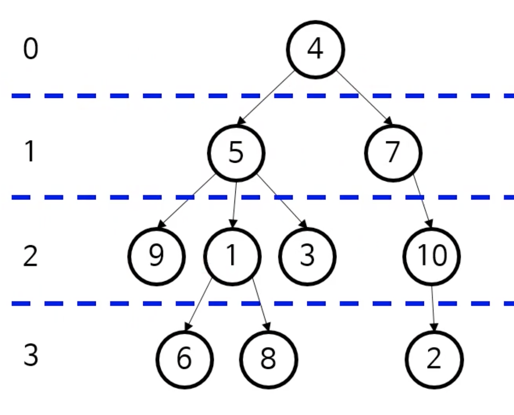
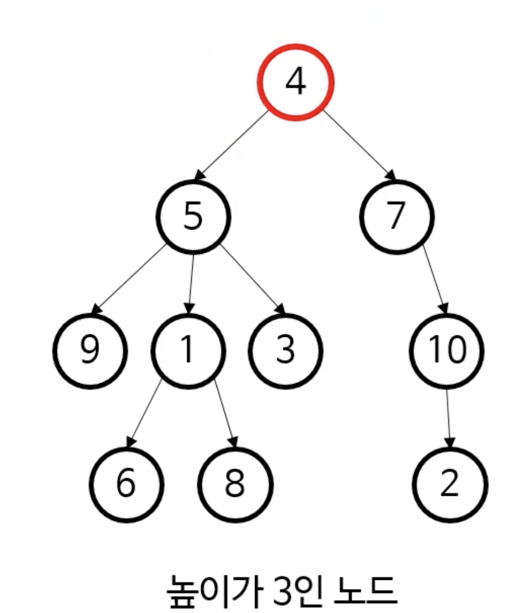
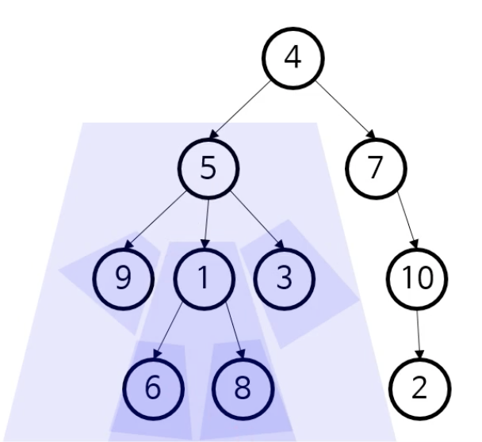
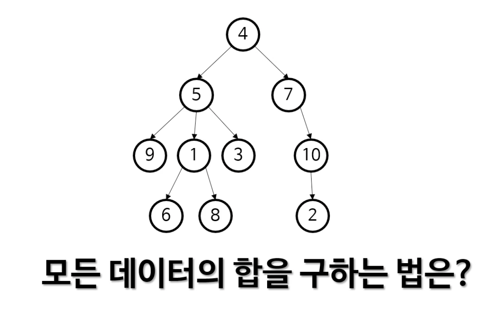
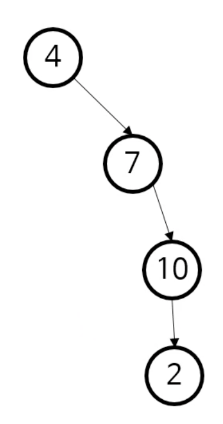

## 트리 관련 용어

* 노드(node): 실제로 저장하는 데이터
* 루트(root) 노드: 최상위에 위치한 데이터
* 리프(leaf) 노드: 마지막에 위치한 데이터들
* 부모-자식: 연결된 노드들 간의 상대적 관계
* 깊이(depth): 노드 ➜ 루트 경로의 길이
  * 9는 깊이가 2이다. 4는 깊이가 0이다.



* 높이(height): 노드 ➜ 리프 경로의 최대 길이
  * 노드 5의 높이는 2이다. 
  * 어떤 노드의 높이가 아닌, 트리의 높이를 물어보면 루트 노드의 높이를 물어보는 것과 같다.



* 하위 트리(subtree): 어떤 노드 아래의 모든 것을 포함하는 트리
  * 하위 트리 그 자체가 트리 ➜ 트리가 **재귀적으로 작동하기 좋은 자료구조**라는 걸 알 수 있다.




## 트리는 재귀적 자료구조



* 4 + 왼쪽 subtree 의 총합 + 오른쪽 subtree의 총합 .. ➜ 이렇게 재귀적으로 더해나갈 수 있다.


## 트리를 저장하려면 코드로 어떻게 표현해야 할까?

### 1) 일반적인 트리

```java
public class Node {
  public int data;
  public ArrayList<Node> children; // hashMap 으로 구현해도 되고.. 마음대로
}
```

### 2) 이진 트리

```java
public class Node {
  public int data;
  public Node left;
  public Node right;
}
```

### 3) 자식이 최대 하나인 트리

```java
public class Node {
  public int data;
  public Node child;
}
```



➜ 연결 리스트이다. 연결리스트는 결국 트리에서 좀 더 제약을 가한 자료구조이다.


## 트리의 용도

* 계층적 데이터를 표현
  * HTML 이나 XML 의 문서 개체 모델(DOM) 을 표현
  * JSON 이나 YAML 처리 시 계층 관계를 표현
  * 프로그래밍 언어를 표현하는 추상 구문 트리(abstract syntax tree)
  * 인간 언어를 표현하는 파싱 트리(parsing tree)
* 검색 트리를 통해 효율적인 검색 알고리듬 구현 가능
* 그 외 다수


