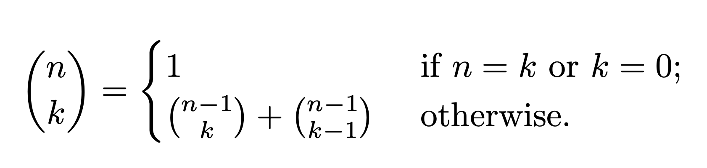
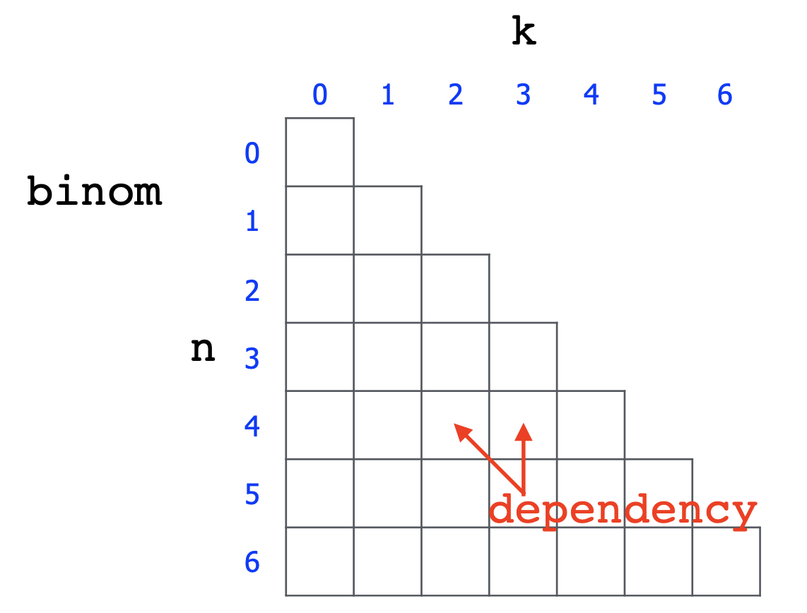

# 이항계수

  ### n개 중에서 k개를 뽑아보자

  

  총 3가지 경우의 수가 있다.

  * n과 k가 같은 경우
  * k = 0 인 경우 (즉, 아무것도 뽑지 않는 경우)
  * 그 외
    * A를 선택하는 경우의 수 + A를 선택하지 않는 경우의 수

  

  #### DP를 이용해서 이항계수 문제를 가장 효율적으로 해결할 수 있다.

  * Bottom-up 방식
    * 단순히 아래에서 위로 가는 의미가 아니다. `기본적인 값 ➜ 내가 원하는 값` 으로 올라 온다는 뜻이다.
    * Bottom-up 방식으로 중복 계산을 피할 수 있다.

  

  

  #### n 개 중 k 개를 뽑는 경우의 수를 나타내는 코드이다.

  ```java
  int binomial(int n, int k) {
          for (int i = 0; i <= n; i++) {
              for (int j = 0; j <= k && j <= i; j++) {
                  if (k == 0 || n == k) {
                      binom[i][j] = 1;
                  } else
                      binom[i][j] = binom[i-1][j-1] + binom[i-1][j];
              }
          }
          return binom[n][k];
      }
  ```

  

  ### 관련 문제

  [백준 11050. 이항계수1]([www.acmicpc.net/problem/11050](https://www.acmicpc.net/problem/11050))

  [백준 1010. 다리 놓기](https://www.acmicpc.net/problem/1010)

  

---

  #### 참조

  * https://www.youtube.com/watch?v=MjW10t9ppok&t=1325s