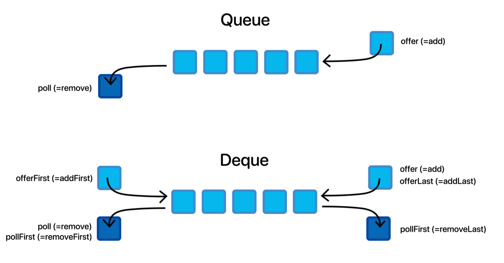
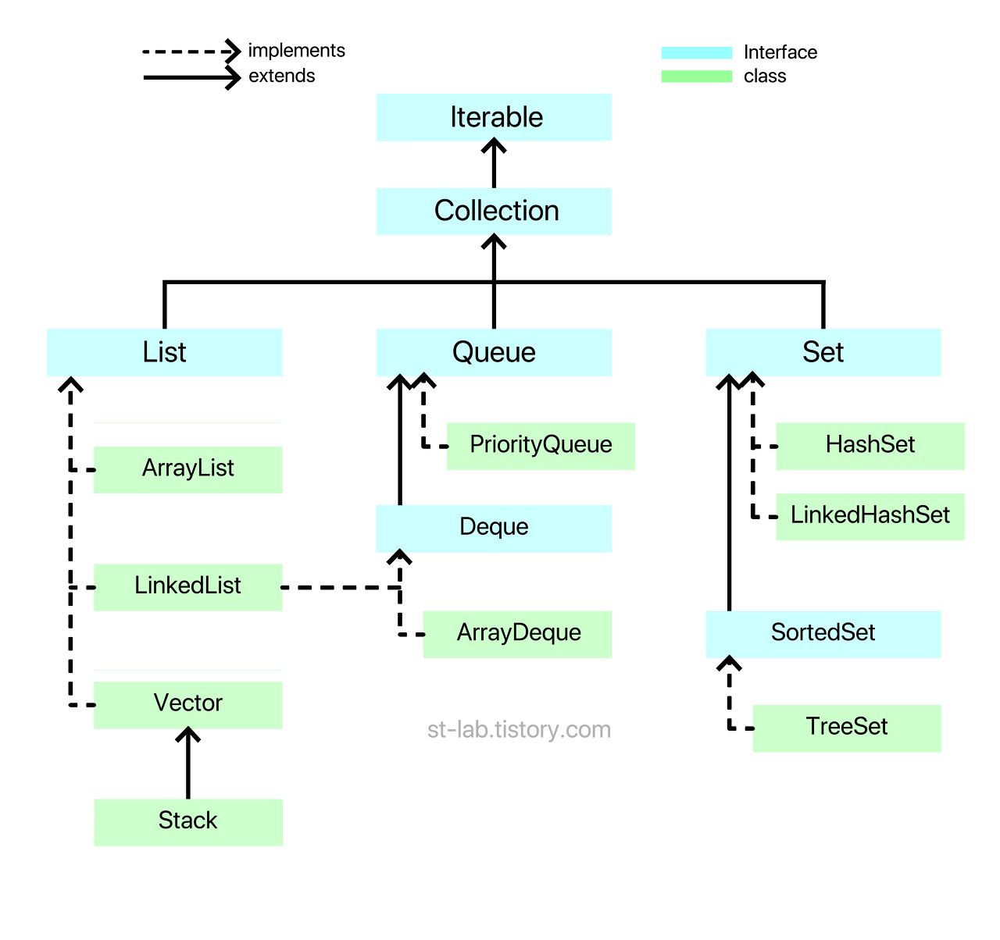

# 큐 

* 큐는 단방향으로 데이터가 들어가는 방향과 나오는 방향이 다르다.
* 반면 덱은 Double-ended Queue 의 줄임말인데, 말 그대로 양방향의 지점이 있는 큐다.




### 맨 뒤의 요소를 반환해야 하는 경우

* Queue 라이브러리에는 C++의 경우 **가장 맨 뒤에 있는 요소를 반환하는** back() 메소드가 있지만, Java의 경우는 Queue 인터페이스로 선언하여 라이브러리를 사용할 경우 **back() 과 같은 역할을 하는 메소드는 없다**. 

  * 맨 앞의 원소를 반환하는 peek() 메소드는 있다.

  ```java
  Queue<Integer> q = new LinkedList<>();
  Queue<Integer> q = new ArrayDeque<>();
  ```

  

* 해결책? Deque 인터페이스를 이용하자

  ```java
  Deque<Integer> q = new LinkedList<>();
  Deque<Integer> q = new ArrayDeque<>();
  ```




