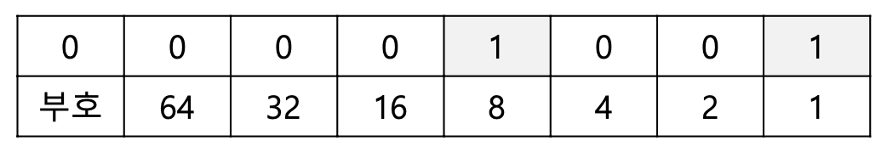
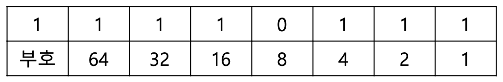
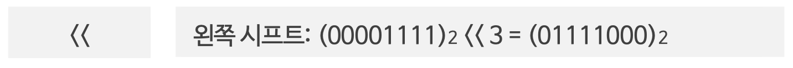
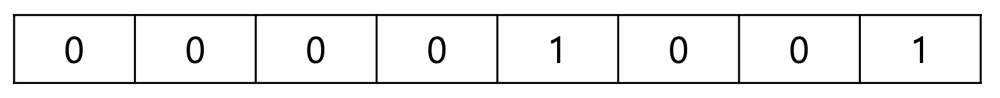
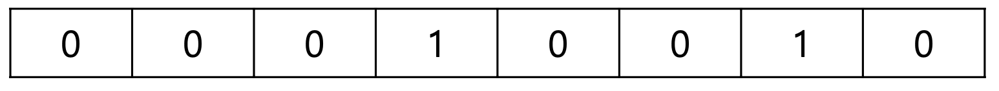

## 컴퓨터가 정수를 처리하는 방법

* 컴퓨터는 내부적으로 2진수로 숫자를 표현한다. (0과 1로만 표현)
* 9는 다음과 같이 나타낸다.



이렇게 총 8개의 bit 만 있어도 최대 127까지 표현할 수 있다.


* -9를 표현하는 방법은? 
  * 2의 보수를 사용한다. 2의 보수 = 1의 보수 + 1 
    * 1의 보수 -> 모든 비트 뒤집기 방식




## scanf() 의 &의 의미

* &은 특정한 변수의 주소를 의미한다.
* 실제로 컴퓨터는 특정한 메모리 주소에 접근하여 데이터를 수정하므로 &을 이용하는 것이다.
* 그렇다면 메모리 주소에 얼마만큼의 크기로 데이터를 쓸 지도 결정해야 한다.


## 비트 연산자

왼쪽으로 3칸 가라 




### Shift 연산자는 2의 배수를 처리하고자 할 때 효과적이다.

9를 bit로 표현하면 다음과 같다.



왼쪽 시프트를 수행하면 9에서 18로 2배 증가한다.



오른쪽 시프트를 수행하면 2로 나눈 값이 반환된다.


## c언어는 문자열 자료형이 없다

* C언어에서의 문자열은 내부적으로 **문자의 배열**이다.
* C언어는 그 대신 특정한 인덱스의 문자에 바로 접근할 수 있다는 장점이 있다.
* C++ 에서는 이러한 불편함을 알고 있기 때문에 자체적으로 string 자료형을 제공한다.

```c
#define _CRT_SECURE_NO_WARNINGS
#include <stdio.h>
int main(void) { char a[20]; scanf("%s", &a); printf("%s\n", a); system("pause");
}
```

