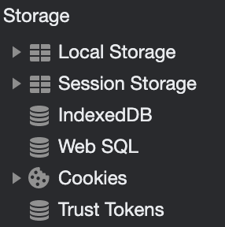

# Web Storage API 



* 브라우저에는 Local Storage, Session Storage, Cookie Storige 등과 같은 다양한 저장소가 존재
* 이러한 저장소를 통해 **서버나 외부 저장소에 데이터를 저장하지 않고 브라우저 자체에 저장할 수 있으며** 웹 개발자가 쉽게 활용할 수 있다.
* Web Storage 는 두 메커니즘을 가지고 있다.
  * sessionStorage: 페이지 세션이 유지되는 동안 사용할 수 있는 각 origin 별로 별도의 스토리지를 관리한다. 
  * localStorage: 브라우저가 닫히고 다시 열리더라도 유지된다.
* `Window` 객체를 통해 사용할 수 있다. `Window.sessionStorage`, `Window.localStorage`
* 

# IndexedDB 란?

* IndexedDB 는 브라우저에서 객체를 저장하고 **트랜잭션 기반으로 데이터를 처리하는 데이터베이스** 
* RDB 보다는 NoSQL 에 더 유사한 유형의 데이터베이스
* origin 별로 여러개의 데이터베이스 생성 가능
* 각 레코드에는 Index 가 존재하기 때문에 빠른 검색 수행 가능


## IndexedDB 구성요소

* 데이터베이스
* 객체 저장소 
* 데이터


## IndexedDB 와 localStorage 의 차이점

|              localStorage              |              IndexedDB               |
| :------------------------------------: | :----------------------------------: |
| key-value 형식의 문자열 값만 저장 가능 | 대부분의 자바스크립트 객체 저장 가능 |
|              Index 지원 x              |   Index가 존재하여 빠른 검색 가능    |
|            트랜잭션 지원 x             |     트랜잭션 기반의 데이터 조작      |
|       간단한 데이터 저장에 적합        |      대용량 데이터 저장에 적합       |
|   동기적인 방식으로 데이터를 읽고 씀   |    이벤트 기반의 비동기 작업 수행    |


## 트랜잭션

IndexedDB 의 트랜잭션 모드는 3가지가 있다.

* versionchange: 버전 변경 (객체 저장소 생성, 삭제, index 추가 등)
  * `onupgradeneeded` 이벤트가 발생하기 전 자동으로 생성되는 트랜잭션이며 **사용자가 직접 생성 불가**
* readonly: 읽기 전용 (데이터 조회)
* readwrite: 읽기 및 쓰기 (데이터 조회, 추가, 삭제, 수정)

```javascript
// db.transaction(객체저장소명, 사용할 트랜잭션모드)
const transaction = db.transaction('user','readwrite')
```


### (1) 데이터 조회하기

> 방법 1. Index 값을 기준으로 특정 데이터 조회
>
> * Index 되어 있는 기본키를 검색하기 때문에 수많은 데이터가 저장되어 있더라도 매우 빠르게 검색된다.

> 방법 2. 커서를 통해 여러 데이터 조회


Index 값을 기준으로 특정 데이터를 조회하는 방법에 대해서만 알아보도록 하겠다. 


#### 방법1. Index 값을 기준으로 특정 데이터 조회

* 기본키 값인 데이터를 조회하는 경우

```javascript
const transaction = db.transaction('user');
const userStore = transaction.objectStore('user');

// 기본키 값이 user01 인 데이터 조회
const getRequest = userStore.get('user01');

// 조회 성공 시, 실행되는 이벤트 핸들러
getRequest.onsuccess = function (event) {
  console.log(getRequest.result);
};

getRequest.onerror = function (event) {
  console.error(event);
}
```


* 기본키가 아닌 다른 index 값을 기준으로 조회하는 경우

```javascript
db.transaction('user')
  .objectStore('user')
  .index('user_name')	// 조회할 index 값을 명시
  .get('Jessica')
  .onsuccess = function (event) {
  console.log(event.target.result);
}
```


### (2) 데이터 수정하기

```javascript
// id 가 user01 인 데이터의 나이를 6으로 수정하는 코드
db = request.result;
const updatedData = {id: 'user01', age: 6, name: 'John'};

db.transaction('user', 'readwrite')
  .objectStore('user')
  .put(updatedData)	// 내부키를 사용하는 데이터를 수정하는 경우 
  .onsuccess = function () {
  console.log('Updated!');
};
```

외부키를 사용하는 데이터를 수정하는 경우는 `put(updatedData, 1)` 과 같이 변경하고자 하는 레코드의 기본키 값을 두 번째 인자로 반드시 전달해야 한다.


----

### 참조

* [Web Storage 란?](https://developer.mozilla.org/en-US/docs/Web/API/Web_Storage_API/Using_the_Web_Storage_API)

