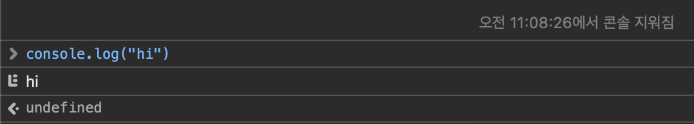
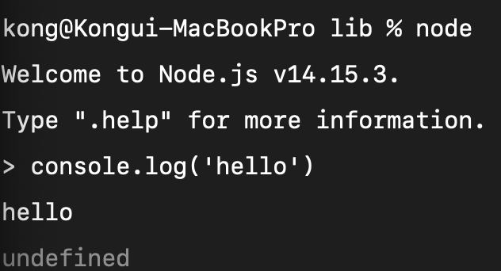

## Node.

* 자바스크립트를 내 컴퓨터에서 실행할 수 있도록 해주는 환경
* Javascript 는 브라우저에 내장되어 있다.



이게 가능한 이유도, JS가 브라우저에 내장되어 있으니깐.

* Node.js 는 Js를 브라우저 밖으로 가지고 나와서 유저의 컴퓨터에서 Javascript를 사용할 수 있도록 해주는 환경이다.

  * **브라우저 밖의 Javascript** 로 무엇을 만들 수 있을까?

    * js를 이용해 서버를 만들 수도 있다.
    * js를 이용해 Web scrapper를 만들어서 웹 페이지에 접속해서 정보들을 수집할 수도 있다.
    * node 를 이용해서 모바일 앱을 만들 수도 있다. 
    * node 를 이용해서 electron 어플도 만들 수 있다.

  * 즉, js를 이용해서 브라우저와는 별도로 작동하는 것을 만들 수 있게 되었다. (더이상 js를 사용하기 위해서 브라우저를 이용할 필요가 없어졌다는 것이다)

  * 터미널에서 **node** 를 입력하고, 브라우저 콘솔창에서 입력했던 대로 입력하면 똑같이 동작하는 것을 볼 수 있다.

    


---

## 실습

실습폴더경로: study > node > express-ex 

* 어떤 프로젝트인지 소개하는 설정파일 만들기 (package.json)
* 해당 모듈이 어떤 모듈인지 보고싶다면 [npmjs](https://www.npmjs.com)  에서 확인

```shell
# 프로젝트 루트 경로에서 package.json 생성
$ npm init -y

# 웹서버 모듈 설치
$ npm install express

# uuid4 설치
$ npm install uuid4
```


* index.js 에서 작성

```javascript
const uuid4 = require('uuid4');
console.log(uuid4());
```


```shell
# index.js 를 node로 실행시켜 확인해보기
$ node index.js
abcae599-6a32-4cec-89c2-c3fe5afb4f1b
```


#### ※ package-lock.json

* 모듈끼리의 충돌을 방지한다.
* 예를 들어 express 모듈은 body-parser v3 에서 최적화가 되어 있고 uuid4 모듈은 body-parser v4 에서 최적화가 되어 있다.
  * 이렇게 각각 참조하고 있는 모듈이 공통되면 충돌날 수 있기 때문에, package-lock.json 의 `requires`에서 명시를 해준다.


* 매번 `node index.js` 를 하긴 힘드니 스크립트로 만들어 편하게 사용해보자
  * 예약어가 아닌 것은 `npm run ` 으로 시작한다 

```json
"scripts": {
    "start" : "node index.js", // 예약어는 npm start
    "dev" : "node index.js"		 // 아닌 경우는 npm run dev
  }
```


