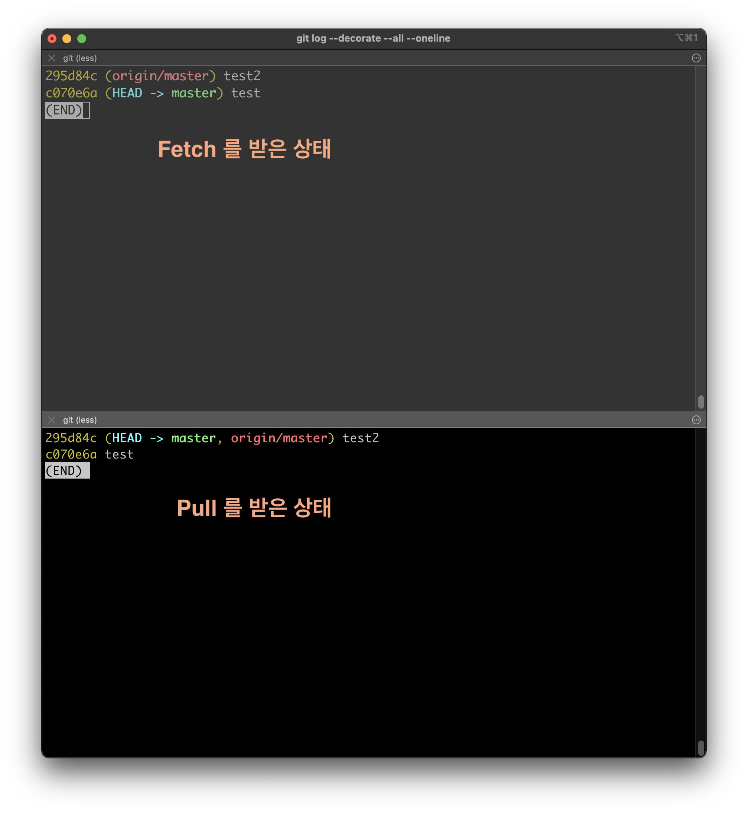
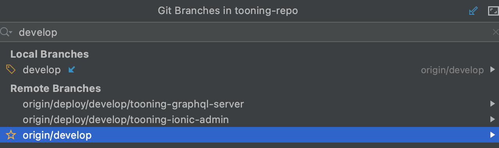

# Pull vs. Fetch

---

### Pull

* 원격저장소로부터 필요한 파일들을 내 로컬로 다운로드 받고, 내 로컬 master 브랜치로 **병합까지 해준다**.

### Fetch

* 원격저장소로부터 필요한 파일들을 내 로컬로 다운로드만 받아놓는다. ➜ 이후 병합 필요 
  * `git merge origin/master` :  병합하고 싶은 브랜치(origin/master) 를 로컬의 master 브랜치로 병합
  * 여기서 말하는 `origin/` 은 로컬 git 이다.
* 즉, 최신 commit 이 원격저장소 몇 번인지는 기록해 놨지만 로컬저장소의 master 브랜치에는 어떠한 변화도 가하지 않은 상태
* HEAD 는 로컬의 master 를 뜻한다.
* Fetch는 어떨 때 사용?
  * 원격저장소의 최신 commit 이 무엇인지 기록만 해놨으니깐 **원격 저장소**와 **로컬 저장소 master 브랜치** 사이의 차이점 비교 가능
    * `git diff HEAD origin/master`  : 코드 차이 비교

---

### 회사 Tip. Fetch 받는 과정

작업하던 브랜치에서 일단 Fetch를 받자.

그러면 현 상태(fetch)는 origin 브랜치들을 최신 commit 까지만 받아오고 로컬 브랜치는 최신 코드가 아닌 것이다. 참고로, origin/develop 도 말만 **Remote Branches** 영역에 있는 것이고 결국 로컬을 뜻한다.

#### 이 이후에 전부 Pull 해오려면?

`origin/develop` 을 기준으로 잡고 (왜냐면 우리는 `origin/develop` 을 최신 기준으로 잡고 작업하고 있으므로) , **merge into current branch ** (현재 작업하던 브랜치로 `origin/develop` 꺼를 merge 한다는 뜻) > Conflict 났다고 뜨면? > 왼쪽 꺼 무조건 넣어.. > 오른쪽 꺼는 확인해보면서 넣어

