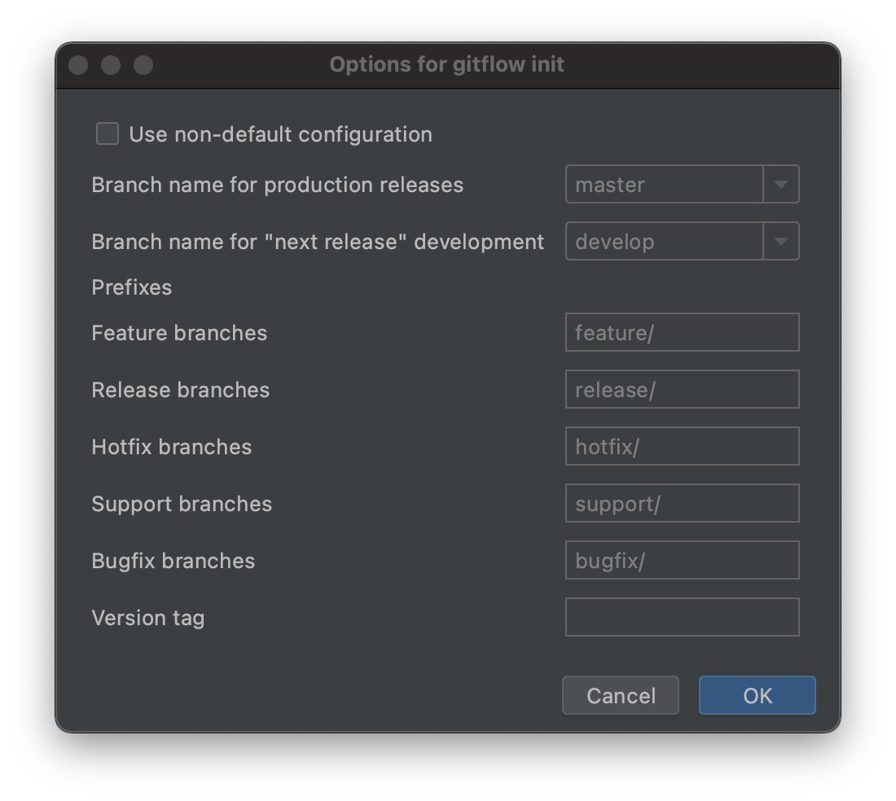

# Git flow 란?

* 브랜치를 어떻게 운영할 것인가에 대한 좋은 사례
* 이 사례를 쉽게 운영할 수 있도록 도와주는 프로그램을 의미할 때도 있다.


## Git flow model 구성

* master branch 
  * master의 가장 최신 버전은 언제나 실행 가능한 상태여야 함
  * 실행 가능한 상태를 만들어가는 과정은 develop branch 에서 진행 
* develop branch
* feature branch - 기능 개발
* release branch 
  * 기능 개선도 다 끝나고 출시 준비를 할 때 사용
  * `git checkout -b release/0.1` : 0.1 버전 출시할 준비를 시작하겠다
    * 급격하게 수정해야 할 버그들이 나타났다?
      * `git commit -am "release 0.1 1"`
      * `git commit -am "release 0.1 2"`
    * 지속적으로 develop branch 에 병합시켜서 나중에 develop branch 에서 충돌이 나는 것을 최소화해야 함
      * `git checkout develop`
      * `git merge release/0.1`
* hotfixes - 긴급한 수정사항 반영할 때 사용

---

### Git flow 도구 없이, git의 command line 을 이용해서 이 Model 이 어떻게 운영되는지를 알아보자

* Release 준비가 끝났다고 가정하자. 이제 master branch 에 병합을 해주어야 하는데 ...
  * `git checkout master`
  * `git merge release/0.1` ➜ 이러면 master 브랜치가 release/0.1 브랜치가 있는 곳으로 fastforward 할 것이기 때문에, 병합이 어떻게 이루어져 있는지에 대한 기록이 남지 않는다.
* Git flow 에서는 이 문제를 해결하기 위해 **--no --ff** 를 이용한다.
  * no fastforward
  * commit msg 를 의도적으로 만드는 것이다.
  * **release/0.1 와 병합했다는 것을 commit log 상에 기록으로 남기겠다는 것이 Git flow 모델의 정책** 이다.
    * `git branch -d release/0.1`
      * 이 브랜치를 삭제 하더라도 master branch 에 release/0.1 branch 가 병합됐다는 증거가 남겨져 있으니 괜찮다.
    * `git tag 0.1` : 0.1 버전이 출시되었다.
      * 제품을 출시할 때는 버전을 기록하기 위해서 태그를 이용하자.
      * 언제라도 출시했던 0.1 버전의 상태로 되돌아갈 수 있다.
* 신규로 추가할 기능이 2개가 있는 상태라고 가정하자.
  * 한 기능은 금방 끝나고, 한 기능은 오래동안 지속되어야 하는 상황이다. ➜ 이거때매 Release 가 미루어지면 안 된다.
  * `git branch feature/short` : 버전 1.0  에 추가를 목표로 진행할 프로젝트이다.
  * `git branch feature/long` 

- feature/short 브랜치에서 기능구현이 다 완료된 상태이다. 이제 develop branch 에 병합해보자
  - `git checkout develop`
  - `git merge --no --ff feature/short`
  - `git branch -d feature/short`
- 이제 Release 1.0 을 출시하는 절차를 밟아보자
  - `git checkout -b release/1.0`
    - 이 상황에서 기존 파일의 버그라던지, 새로운 기능 추가된 것 (feature/short에서 작업했떤) 의 버그도 전부 이 브랜치에다가 commit 해준다.
      - develop branch 에 위 작업들을 다시 병합해주자.
        - `git checkout develop`
        - `git merge --no --ff release/1.0`
- 이제 master branch 에 적용해주자
  - `git checkout master`
  - `git merge --no --ff release/1.0`
  - `git tag 1.0`
  - `git branch -d release/1.0`
- 그런데 갑자기 긴급하게 수정해야 하는 문제가 발견되었다.
  - 정식으로 출시한 버전(Tag 1.0) 에 버전 하나만 추가해서 바로 다음 버전(Tag 1.1)으로 출시하자.
    - git checkout -b hotfixes/1.1
      - 수정사항 소스 생성, add, commit .... 
    - master branch, develop branch 둘 다에게 보내서 충돌이 일어나지 않도록 해야 한다.
      - `git checkout develop`
      - `git merge --no --ff hotfixes/1.1`
      - `git checkout master`
      - `git merge --no --ff hotfixes/1.1`
      - `git tag 1.1`
      - `git branch -d hotfixes/1.1`

---

## Webstorm 에 Git flow 플러그인 적용

* git-flow 설치 (21.04.23 기준 0.7.6v)

```bash
brew install git-flow-avh
```

* Webstorm plugin market 에서 플러그인 설치
  * 우측 아래 No Gitflow > Init Repo > Options for gitflow init 창이 뜸 > OK 



---

### 출처

https://www.youtube.com/watch?v=EzcF6RX8RrQ


