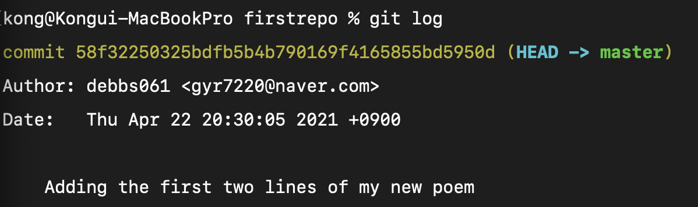

# Git 사용법 

* 폴더 새로 생성 후 `git init` 입력

* `git log` 시 고유한 commit ID 와 commit Msg 를 볼 수 있다.

* `git reset HEAD~1` : 직전 커밋을 지울 수 있다. 

  * git log 시에도 사라짐

* `git reset --hard HEAD~1` : 직전 수정 내용도 지우고, 커밋 기록도 지운다.

* `git checkout -b fourth-line` : 브랜치 하나 파기

* `git merge fourth-line` : fourth-line 브랜치의 내용과 합친다.