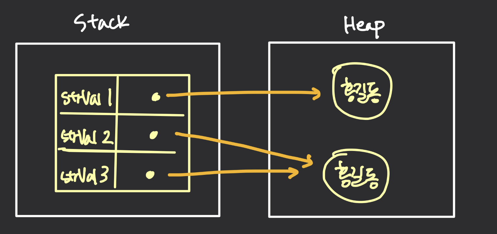

# == 과 equals() 의 차이

* == 

  * **동일 비교 연산자**
    * 동일한 객체인지를 확인한다. 즉, 같은 주소인지를 비교한다. (hashcode)
  * primitive type 들은 **==** 으로 비교하면 됨
* equals()
  * 재정의하지 않는 이상 == 이랑 같은 로직을 가지고 있다. 개발자가 Value Object를 비교하기 위해 Override 해서 동치 관계 조건에 맞는 로직을 구현해주어야 **동등 비교** 가 된다.
  * non-primitive type 들은 equals 메소드를 가지고 있고 대부분 재정의 하고 있다.

## String 에서의 == 과 equals()

* == 연산자는 각 변수에 저장된 번지를 비교한다.
* equals는 문자열 자체를 비교한다. (String 클래스가 equals 메소드를 오버라이딩)

* 자바는 **문자열 리터럴**이 동일하다면 동일한 String 객체를 참조하도록 되어 있다. 

  * 그래서 strVal2 와 strVal3 는 동일한 String 객체를 참조한다.
  * strVal1 은 new 연산자로 생성된 다른 String 객체를 참조한다.

  ```
  String strVal1 = new String("홍길동");
  String strVal2 = "홍길동";
  String strVal3 = "홍길동";
  ```




---

참조

신용권, **『**이것이 자바다**』**, 한빛미디어(2015), p500

