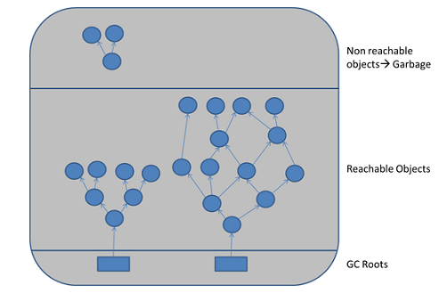
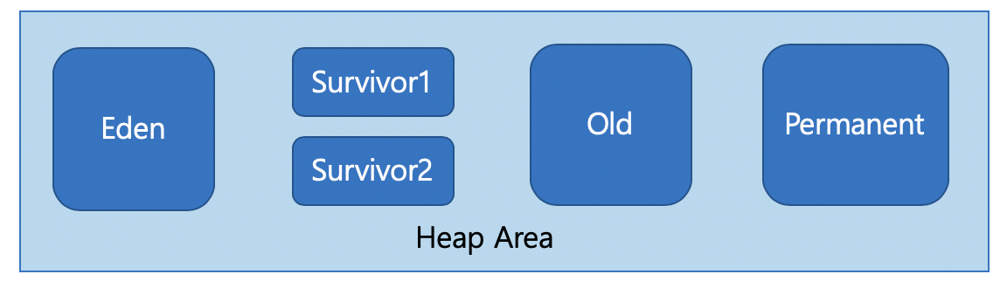

# GC

---

## 목차

1. GC란?
2. GC의 수거 대상
3. GC의 동작 순서 
4. GC는 언제 일어날까?
5. GC의 특징
6. GC의 종류

----

### 1. GC란?

JVM의 Heap 영역에서 사용하지 않는 객체를 삭제하는 프로세스를 말한다.

`Heap` : 동적으로 할당된 메모리 영역

Heap 에는 모든 Object 타입의 데이터가 할당된다. Heap 영역의 Object를 가리키는 참조 변수가 Stack에 할당된다.

### 2. GC의 수거 대상: Reachability

+ 어떤 객체에 유효한 참조가 존재한다면 Reachable, 그렇지 않다면 Unreachable 이라고 한다.
+ GC Roots가 되는 대상들
  + stack 영역의 데이터들
  + method 영역의 static 데이터들
  + JNI에 의해 생성된 객체들

### 3. Mark and Sweep

+ Mark

  + GC Root로부터 모든 변수를 스캔하면서 각각 어떤 객체를 참조하고 있는지 찾아서 마킹한다.

+ Sweep

  + Unreachable 객체들을 Heap 에서 제거한다.

+ Compact

  + Compact는 알고리즘에 따라서 추가되기도 하는 과정이다.
  + Sweep 후에 분산된 객체들을 Heap 의 시작 주소로 모아 메모리가 할당된 부분과 그렇지 않은 부분으로 나눈다.

  

### 4. GC는 언제 일어날까? : Heap의 구조

+ Heap 은 Young Generation 과 Old Generation으로 구성된다.
  + Young Generation - 새로운 객체들이 할당되는 영역
  + Old Generation - Young Generation에서 오랫동안 살아남은 객체들이 존재하는 영역 

+ 언제 일어나는가?

  + 새로운 객체가 Eden 영역에 할당된다.

  + Eden 영역이 꽉 차서 더이상 할당될 공간이 없다면 Minor GC가 발생한다.

  + Minor GC가 한 번 발생할 때마다 Survivor 영역을 왔다 갔다 한다. 

    + Mark and Sweep 과정이 일어난다.
      + GC에서 살아남은 객체들은 Survivor 영역으로 이동한다.
      + unreachable한 객체들은 삭제된다. 
      + Survivor 영역에 있는 객체들의 age가 증가한다. (Aging)
    + 객체의 age가 age threshold에 도달하면 Old Generation으로 이동한다. (Promoted)
    + Old Generation 이 꽉 차면 Major GC가 일어난다.

    

### 5. GC의 특징 : stop-the-world

+ GC를 실행하기 위해 JVM이 애플리케이션 실행을 멈추는 것
  + GC를 실행하는 쓰레드 외의 모든 쓰레드가 작업을 중단한다.

----

**참조**

https://www.youtube.com/watch?v=Fe3TVCEJhzo