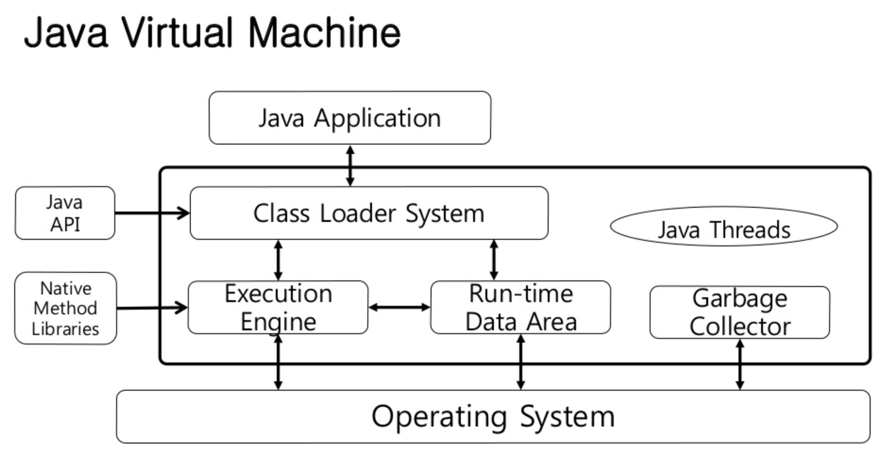

# JVM 이란

* 운영체제는 자바 프로그램을 바로 실행할 수 없는데, 그 이유는 자바 프로그램은 완전한 기계어가 아닌, 중간 단계의 바이트 코드이기 때문에 이것을 해석하고 실행할 수 있는 가상의 운영체제가 필요하다. 이것이 JVM 이다.
* JVM이란 자바 프로그램을 자바 API를 기반으로 실행하는 역할을 한다.
* 자바 바이트코드는 타겟 플랫폼에 상관 없이 JVM 위에서 동작한다.
  * ex) 리눅스에서 컴파일 한 자바 바이트코드를 윈도우에서 실행해도 아무 문제가 없다.

## 굳이 JVM?

* C/C++ 도 크로스 컴파일(플랫폼에 따라 컴파일)해서 배포하면 되는데, 굳이 JVM을 사용해야 하나?
* 자바는 네트워크에 연결된 모든 디바이스에서 작동하는 것이 목적이었다.
  * 핸드폰, 아이패드..
  * 디바이스마다 운영체제나 하드웨어가 다르기 때문에, 자연스럽게 플랫폼에 의존하지 않도록 언어를 설계했다. 그 결과가 Java Bytecode, JVM

## JAVA 프로그램 실행과정

* 프로그램이 실행되면 JVM 이 OS로부터 메모리를 할당받고
* 자바 바이트코드로 변환된(.class) 파일을 class 로더를 통해 JVM에 로딩한다.
* 로딩된 class 파일은 execution engine을 통해 해석되고 실행된다.

