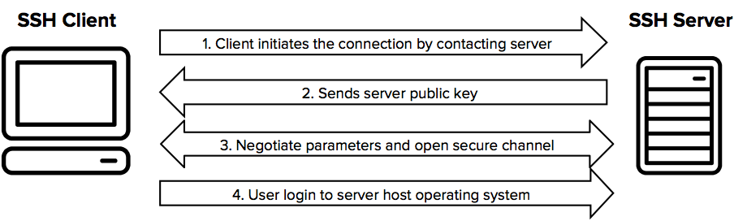

# SSH 란

* 원격지에 있는 컴퓨터를 제어하기 위한 프로토콜 또는 이 프로토콜을 사용하는 프로그램들을 의미한다.
* 클라이언트와 서버 사이에는 강력한 암호화 방법을 통해서 연결되어 있다.
  * 중간에서 가로채도 해석 할 수 없는 암호화된 문자만 노출됨
  * SSH 이전에는 FTP, Telnet 이용 ➜ 보안상 이슈

* SSH 원격제어를 하려면 Client 쪽에는 SSH Client & Server 쪽에는 SSH Server 가 설치되어 있어야 한다.
  * 유닉스 계열의 운영체제에는 SSH 클라이언트와 서버를 포함하는 *OpenSSH* 가 설치되어 있기 때문에 SSH 를 이용하기 위한 특별한 조치는 필요하지 않다.





* `sudo ps aux | grep ssh`

  

## SSH Tunneling


### (1) Remote Port Forwarding

* When I want people to access local resources that they don't have access to 
* ex. Local web server

#### 동작 방식

* 44.11.22.33:8888 로 TCP request 가 들어옴 
* SSH Server는 8888 포트(자기 마음대로 지정 가능) 로 listening 중이어서 해당 packet 을 받아서 encapsulate 하여서 
* SSH request 를 보냄
* SSH Client (나) 는 SSH Tunnel 임을 알고 10.0.0.3:8080 으로 request 보냄


```shell
sudo ps aux | grep ssh

# ssh : openSSH 클라이언트를 실행시키는 명령어
# ssh -R bindport:host:hostport public_ssh_server 
ssh -R  80:localhost:4200 localhost.run
```


----

(회사) 실습

* `localhost.run` 프로그램 이용
  * 로컬 웹 서버를 외부에서 접근할 수 있도록 해주는 프로그램이다.
  * `localhost.run` 에서 랜덤한 url 을 제공하여 외부에서 이 url 을 이용해 로컬 웹 서버에 접근할 수 있도록 해준다.
  * 즉, 따로 네트워크 설정 및 포트포워딩을 해주지 않아도 로컬 서버를 public 하게 사용할 수 있도록 해준다.

---

### 참조

* [SSH Tunneling - Remote Port Forwarding](https://www.youtube.com/watch?v=N8f5zv9UUMI)

