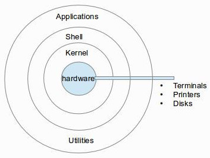

# bash vs. zsh

* `echo $0` : 현재 쓰고있는 shell 제품이 출력 됨
* 명령들은 zsh 을 통해 kennel 로 전달 되고 있고, kennel 에서 만들어진 결과는 zsh 을 통해 우리의 화면에 표시되고 있는 것

---

### 참조

* https://edu.goorm.io/learn/lecture/12984/생활코딩-리눅스-linux/lesson/563278/bash-vs-zsh