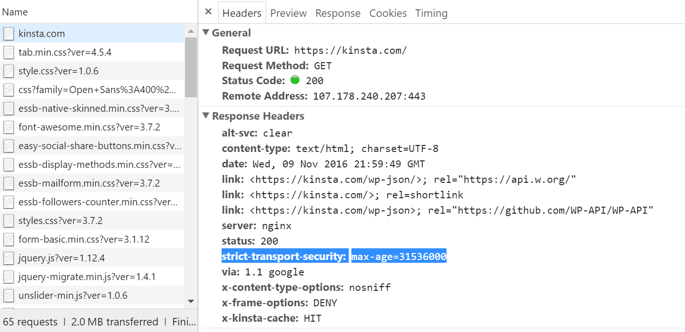

# 브라우저에 www.naver.com 을 입력했을 때 발생하는 일들

## 1. 브라우저의 URL 파싱

URL 을 입력받은 브라우저는 일단 이 URL 의 구조를 해석한다. 어떤 프로토콜로 어느 도메인으로 어떤 포트로 보낼 지를 해석하게 되는 것이다. 

명시적으로 포트를 선언하지 않았다면 브라우저에서는 설정된 기본값을 이용해 요청하게 된다. 

* HTTP : 80
* HTTPS : 443

## 2. HSTS 목록 조회

* HSTS (HTTP Strict Transport Security)
  * HTTP 대신 HTTPS 만을 사용하여 통신해야한다고 웹사이트가 브라우저에게 알리는 보안 기능
* 만약 HTTP로 요청이 왔다면 HTTP 응답 헤더에 "Strict Transport Security" 라는 필드를 포함하여 응답하고 이를 확인한 브라우저는 이 이후에 해당 서버에 요청할 때 자동으로 HTTPS 만을 통해 통신하게 된다.

* 즉, 브라우저에서는 이 HSTS 목록 조회를 통해 해당 요청을 HTTPS로 보낼 지 판단한다.
* HSTS 목록에 해당 URL 이 존재한다면 명시적으로 HTTP를 통해 요청한다 해도 브라우저가 이를 HTTPS 로 요청한다.

## 3. URL을 IP 주소로 변환

**www.naver.com** 이라는 주소로는 컴퓨터끼리 통신할 수 없다. 이를 인터넷 상에서 컴퓨터가 읽을 수 있는 IP 주소로 변환해야 서로 통신이 가능하게 된다. 

* 우선 브라우저에서는 자신의 로컬 hosts 파일과 브라우저 캐시에 해당 URL 이 존재하는지를 확인
* 존재하지 않는다면, 도메인 주소를 IP 주소로 변환해주는 DNS 서버에 요청하여 해당 URL 에 대한 IP 주소를 가져옴

### DNS의 동작 원리

1. www.naver.com 입력 ➜ 웹 브라우저 캐시에 www.naver.com 에 대한 IP 주소가 있는지 찾아본다. (캐시는 한 번 가져온 값을 저장하고 있다가 일정 시간이 지나면 삭제함)
2. 캐시에 없다면, PC는 미리 설정되어 있는 Local DNS (단말에 설정되어 있는 DNS) 에게 www.naver.com 이라는 hostname 에 대한 IP 주소를 물어본다.
   * Local DNS 는 **/etc/hosts** 에서 설정 가능
   * 이 hosts 파일은 운영 체제가 호스트 이름을 IP 주소에 매핑할 때 사용하는 컴퓨터 파일이다.
3. hosts 파일에 www.naver.com 에 대한 IP 주소가 없다면, 다른 DNS 서버들과 통신 (DNS 메시지) 을 시작한다.
   * Root DNS 서버에게 "www.naver.com 에 대한 IP 주소 아니?" 물어본다.
     * 이를 위해 각 Local DNS 서버에는 **Root DNS 서버의 정보 (IP주소) 가 미리 설정되어 있어야** 한다.
   * 이 Root DNS 서버는 전세계에 13대가 구축되어 있다.
4. Root DNS 서버가 IP 주소를 모른다면, Local DNS 서버에게 "난 www.naver.com 에 대한 IP 주소를 몰라. 내가 알려주는 다른 DNS 서버에게 물어봐" 라고 응답한다.
   * 이 다른 DNS 서버는 **com 도메인**을 관리하는 DNS 서버를 말한다.
5. 이번엔 com 도메인을 관리하는 DNS 서버에게 다시 www.naver.com 에 대한 IP 주소를 물어본다.
6. 역시 com 도메인을 관리하는 DNS 서버에도 해당 정보가 없다. 그러면 이 DNS 서버는 _naver.com DNS 서버_ 에게 물어보라고 한다.
7. 이번엔 _naver.com DNS 서버_ 에게 물어본다.
8. 이 서버는 www.naver.com hostname 에 대한 IP 주소가 있어서 Local DNS 서버에게 IP 주소를 응답해준다.
9. 이를 수신한 Local DNS 는 다음 번에 바로 응답을 줄 수 있도록 www.naver.com 에 대한 IP 주소를 캐싱하고 그 IP 주소 정보를 단말(PC) 에 전달한다.
10. 웹 브라우저는 www.naver.com 에 대한 캐시를 업데이트 한다.

#### 이와 같이 Local DNS 서버가 여러 DNS 서버를 차례대로 (Root DNS -> com DNS -> naver.com DNS) 물어봐서 그 답을 찾는 과정을 Recursive Query 라고 부른다.

## 4. 라우터를 통해 해당 서버의 게이트웨이까지 이동

DNS 서버에게 IP 주소를 받았으니 이제 해당 서버로 요청을 보낼 차례이다. 이 IP 주소로 가야 하는 것은 알지만 어떻게 가야 할지 경로는 알 수 없다. 이 요청이 네트워크를 타고 어떻게 이동할지는 네트워크 장비인 라우터의 라우팅을 통해 이루어진다.

## 5. ARP를 통해 IP 주소를 MAC 주소로 변환

실질적인 통신을 하기 위해서는 논리 주소인 IP 주소를 물리 주소인 MAC 주소로 변환해야 한다. 

이를 위해 해당 네트워크 내에서 ARP 를 브로드 캐스팅한다. 해당 IP 주소를 가지고 있는 노드만이 자신의 MAC 주소를 담아 응답한다.

* ARP (Address Resolution Protocol)
  * 해당 IP를 그 IP주소에 맞는 물리적인 주소 즉, MAC 주소를 가지고 오는 프로토콜

## 6. 대상 서버와 TCP 소켓 연결

이제 대상 서버와 통신하기 위해 **TCP 소켓 연결을 진행**한다. 소켓 연결은 3-way-handshake 라는 과정을 통해 이루어진다. 

지금 예시로 든 요청은 HTTPS 요청이므로 서로 암호화 통신을 위한 **TLS 핸드쉐이킹이 추가**된다. 이를 통해 서버와 클라이언트는 암호화 통신을 진행할 수 있다. 

* SYN : 접속 요청 
* ACK : 요청 수락 

## 7. HTTP(HTTPS) 프로토콜로 요청, 응답

이제 연결이 확정되었으니 드디어 해당 페이지 www.naver.com 을 달라고 서버에게 요청한다. 

서버에서 해당 요청을 받고, 이 요청을 수락할 수 있는지 검사한다. 그리고 서버는 이 요청에 대한 응답을 생성하여 브라우저에게 전달한다.

## 8. 브라우저에서 응답을 해석

서버에서 응답한 내용은 HTML, CSS, Javascript 등으로 이루어져 있다. 이를 브라우저에서 해석하여 렌더링해준다.

---

### 참조

https://deveric.tistory.com/97

https://www.netmanias.com/ko/post/blog/5353/dns/dns-basic-operation

https://developer.mozilla.org/ko/docs/Web/HTTP/Headers/Strict-Transport-Security