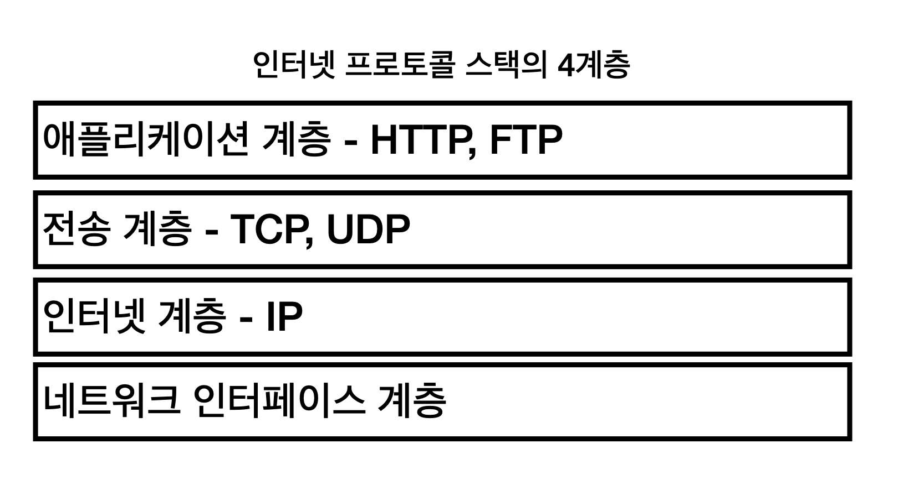
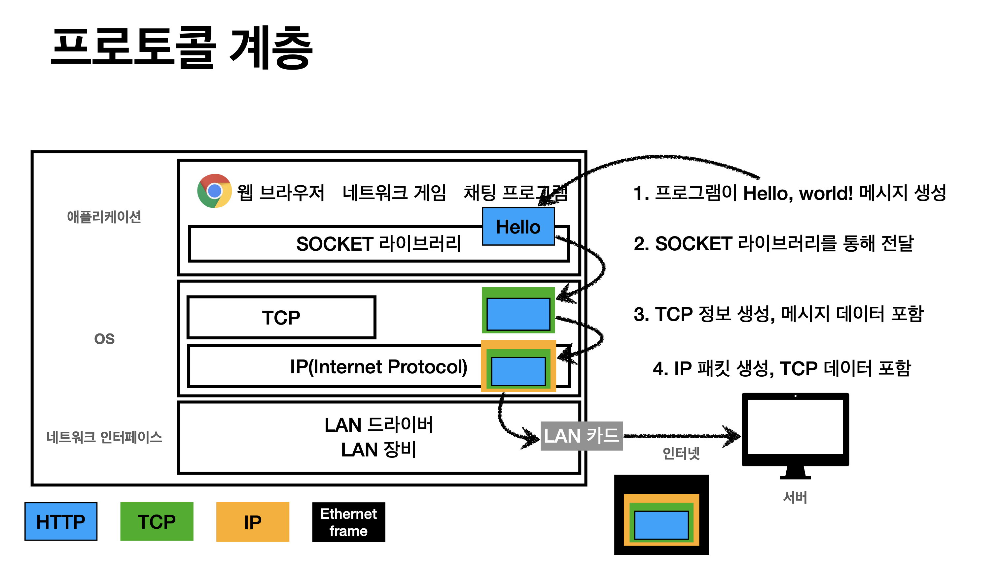
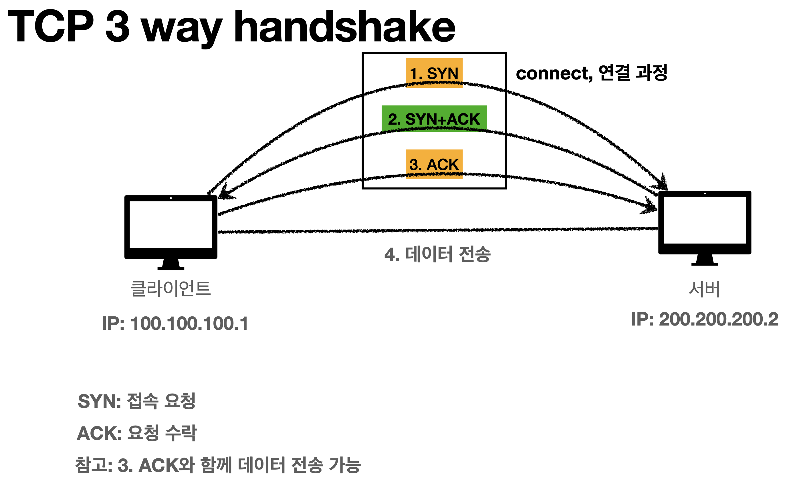

# 1. IP (인터넷 프로토콜)

## 인터넷 프로토콜의 역할

* 지정한 IP 주소에 데이터 전달
* 패킷이라는 통신 단위로 데이터 전달

---

## 패킷 전달 과정 

* 클라이언트에서 출발지 IP와 목적지 IP 와 데이터를 패킷에 넣어서 인터넷 망에 전달
* 인터넷 프로토콜에 의해서 모든 서버들이 다 규약을 따르고 있어서 패킷을 보고 출발지 IP, 목적지 IP 를 다 이해하고 있음
* 200.200.200.2 를 받을 수 있는 서버가 어디야? 하면서 서로 노드끼리 던짐

----

## IP 프로토콜의 한계

* 비연결성
  * 패킷을 받을 대상이 없거나 서비스 불능 상태여도 패킷 전송
* 비신뢰성
  * 중간에 패킷이 사라지면? (중간 매개체 서버가 갑자기 꺼져버리면)
  * 패킷이 순서대로 안오면?
    * 보통 1500byte 씩 패킷을 끊어서 보냄
* 프로그램 구분
  * 같은 IP 를 사용하는 서버에서 통신하는 애플리케이션이 둘 이상이면? 
    * 한 pc에서 음악도 듣고, 인터넷 게임도 하는 상태..

-----

## TCP 

* 이런 IP 프로토콜의 문제점을 해결해주는 것이 바로 TCP
* 인터넷 프로토콜 스택의 4계층
  * IP 위에 TCP 를 올려서 보완해주었다

* TCP/IP 패킷 정보 : TCP 정보에 ``전송제어, 순서, 검증 정보, port`` 등이 들어감으로써 IP 만으로 해결이 안됐던 것들이 해결됨
* Ethernet Frame : LAN 카드에 등록된 MAC 주소 등과 같은 물리적인 정보가 포함되어 있음

### TCP 특징 (전송 제어 프로토콜)

* 연결지향 - TCP 3 way handshake (가상연결)
* 데이터 전달 보증 
  * 서버가 데이터를 받으면 데이터를 잘 받았다는 메시지를 보내줌
* 순서 보장
  * TCP 세그먼트에 전송제어, 순서, 검증정보가 포함되어 있기 때문에 가능한 일

➜ 신뢰할 수 있는 프로토콜이며 현재 대부분 TCP 사용

---

## UDP 특징 (User Datagram Protocol )

* 하얀 도화지에 비유 (기능이 거의 없음)
* IP 와 거의 같음. + port + 체크섬 정도만 추가
* 애플리케이션에서 추가 작업 필요
  * 사용자가 애플리케이션 level에서 최적화해서 구현 가능하다는 장점

----

## PORT

* 0 ~ 65535 할당 가능
* 0 ~ 1023: 잘 알려진 포트, 사용하지 않는 것이 좋음
  * FTP - 20, 21
  * TELNET - 23
  * HTTP - 80
  * HTTPS - 443

---

## IP 주소

* IP는 기억하기 어렵다
* IP는 변경될 수 있다 
* 전화번호부 역할을 해주는 서버가 존재하는 것임
  * 도메인 명을 IP 주소로 변환 

---

#### 출처

* 인프런 - 김영한 HTTP 기초 강의

