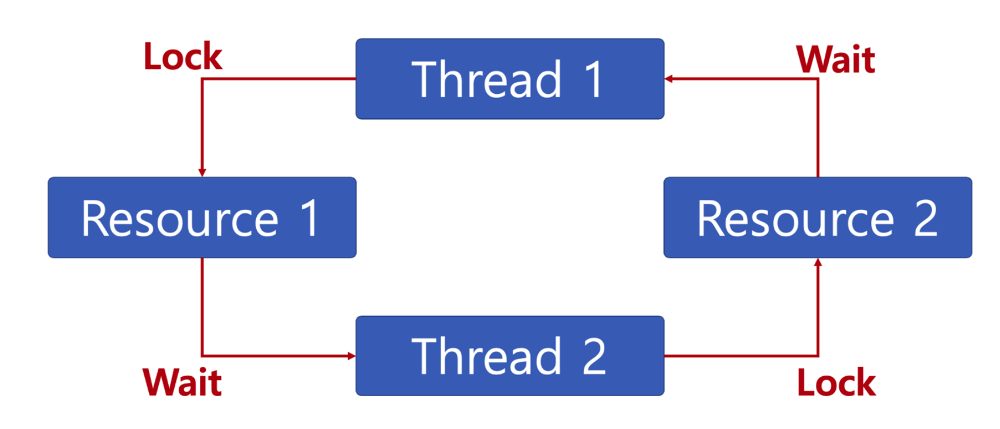

# Deadlock

## 교착상태란?

* 무한 대기 상태: 두 개 이상의 작업이 서로 상대방의 작업이 끝나기만을 기다리고 있기 때문에, 다음 단계로 진행하지 못하는 상태 
* 배치 처리 시스템에서는 일어나지 않는 문제이다.
* 프로세스, 스레드 둘 다 이와 같은 상태가 일어날 수 있다.

## 교착상태 발생 조건

1. 상호배제(Mutual exclusion): 프로세스들이 필요로 하는 자원에 대해 배타적인 통제권을 요구한다.
2. 점유대기(Hold and wait): 프로세스가 할당된 자원을 가진 상태에서 다른 자원을 기다린다.
3. 비선점(No preemption): 프로세스가 어떤 자원의 사용을 끝낼 때까지 그 자원을 뺏을 수 없다. 
4. 순환대기(Circular wait): 각 프로세스는 순환적으로 다음 프로세스가 요구하는 자원을 가지고 있다.

