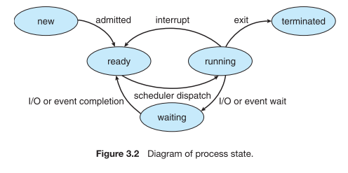

# 인터럽트 (Interrupt)

* CPU가 프로그램을 실행하고 있을 때, 입출력 하드웨어 등의 장치나 또는 예외상황이 발생하여 처리가 필요할 경우에 CPU에 알려서 처리하는 기술

## 인터럽트 필요 이유

1) 선점형 스케쥴러 구현
   * 프로세스 running 중에 다른 프로세스로 교체하기 위해 스케쥴러가 현재 프로세스 실행을 중단시킴
2) IO Device와의 커뮤니케이션
   * 저장매체에서 파일 읽기라든 지 등의 데이터 처리 완료 시, 프로세스를 꺠워야 함 (block state -> ready state)

3. 예외 상황 핸들링
   * cpu 가 프로그램을 실행하고 있을 때, 예외상황이 발생할 경우 cpu가 해당 처리를 할 수 있도록 cpu에 알려줘야 함

## 인터럽트 처리 예

* cpu 가 프로그램을 실행하고 있을 때, 
  * 입출력 하드웨어 등의 장치 이슈 발생