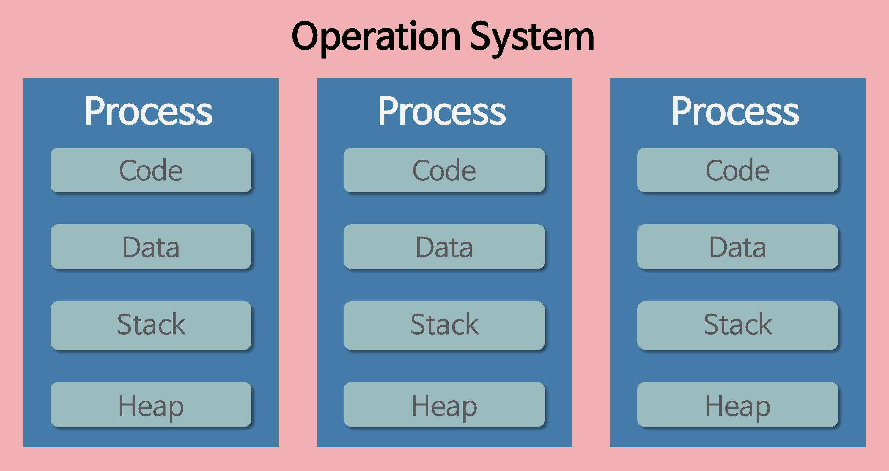
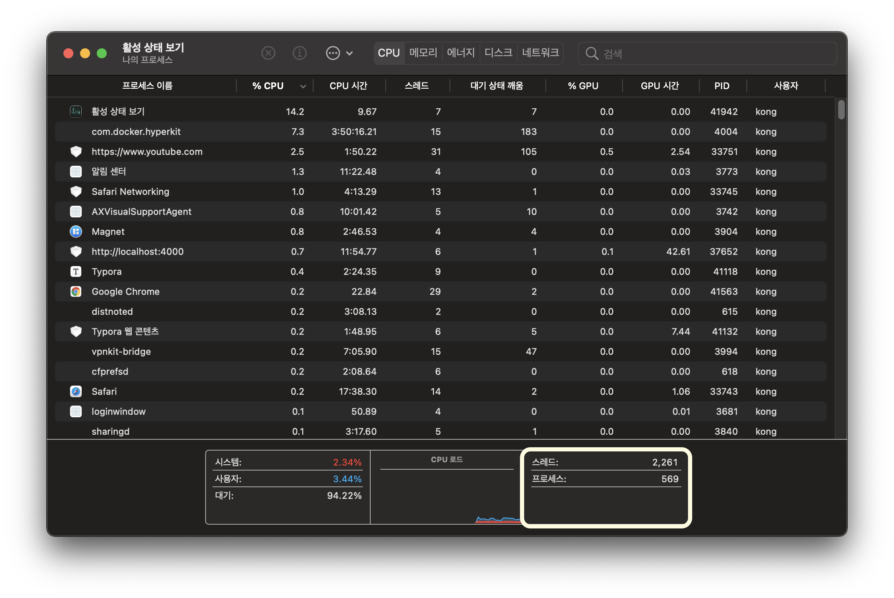
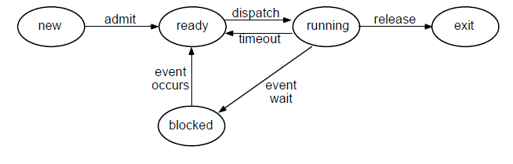
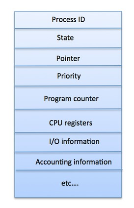

Process & Thread

---

1. 프로그램 (Program)

   * 어떤 작업을 위해 **운영체제 위에서 실행할 수 있는 파일**
   * 예를 들어 웹 브라우저, 워드 프로세서, 카카오톡 등
   * 프로그램은 할당받는 작업 따위 없는 실행 파일 디스크 위에서만 존재하고 있는 존재이다.  

2. 프로세스 (Process)

   * 운영체제 위에서 **실행 중인** 프로그램 
   * 운영체제로부터 시스템 자원을 할당받는 작업의 단위
     * 할당받는 시스템 자원의 예 (context를 가지고 있는 존재이다)
       * CPU 시간
       * 연산에 필요한 레지스터 값들
       * (논리적) Code,Data,Stack,Heap 의 구조로 되어 있는 주소공간
       * (물리적) 독립된 메모리 영역
   * 각 프로세스는 별도의 주소 공간에서 실행되며, 한 프로세스는 다른 프로세스의 변수나 자료구조에 접근할 수 없다.

   

   

3. * Stack : 매개변수, 지역변수 등의 임시적인 자료
   * Heap : 동적으로 할당되는 메모리
   * Data : 전역변수
   * Code : 프로그램의 코드

3. 프로세서 (Processor)
   * 프로세스가 **동작**될 수 있도록 하는 하드웨어 (=cpu)
   * 동작 : 프로그램의 자원들이 메모리에 올라오고, 실행 되어야 할 코드의 메모리 주소를 CPU의 레지스터로 올리는 것

4. 스레드 (Thread)
   * 한 프로세스 내에서 동작되는 코드 실행 흐름으로, 프로세스 내의 주소 공간이나 자원들을 같은 프로세스 내에 스레드끼리 공유하면서 실행된다. 
   
   * 스레드는 스레드 ID, PC, 레지스터 집합, 그리고 스택으로 구성된다. 
   
   * 각각의 스레드는 별도의 레지스터와 스택(로컬주소)을 갖고 있지만, 힙 메모리 공유 x
   
     
   
   * 데이터 섹션(전역변수), 코드 등은 서로 공유 가능하다.

### 스택을 스레드마다 독립적으로 할당하는 이유

* 스택은 함수 호출 시 전달되는 인자, 되돌아갈 주소값 및 함수 내에서 선언하는 변수 등을 저장하기 위해 사용되는 메모리 공간이므로 스택 메모리 공간이 독립적이라는 것은 독립적인 함수 호출이 가능하다는 것이고 이는 독립적인 실행 흐름이 추가되는 것이다. 따라서 스레드의 정의에 따라 독립적인 실행 흐름을 추가하기 위한 최소 조건으로 독립된 스택을 할당한다.

### PC Register 를 스레드마다 독립적으로 할당하는 이유

* PC 값은 스레드가 명령어의 어디까지 수행하였는지를 나타나게 된다. 스레드는 CPU를 할당받았다가 스케줄러에 의해 다시 선점당한다. 그렇기 때문에 명령어가 연속적으로 수행되지 못하고 어느 부분까지 수행했는지 기억할 필요가 있다. 따라서 PC 레지스터를 독립적으로 할당한다.

#### 결론 : 자원은 Process 단위로 받고 작업/스케줄링은 Thread 단위로 진행한다.

----

### 멀티태스킹의 진실

* CPU(프로세서)는 한 순간에 하나의 프로세스만 실행할 수 있다.
* 운영체제가 짧은 시간에 수십번에서 수천번 실행할 프로세스를 **교체** 하고 있기 때문에, 우리는 동시에 여러 개의 작업이 실행되고 있다고 느끼는 것이다.

* 운영체제가 각 프로세스들을 switching 하면서 작업하기 위해서는 프로세스 상태를 알고 있어야 한다.

  

  

* 어떤 프로세스를 어디까지 했는 지 정보를 알 수 있어야 한다. PCB

  

----

## 멀티 프로세스와 멀티 스레드의 차이

### 멀티 프로세스

* 멀티 프로세싱이란

  * 하나의 응용프로그램을 여러 개의 프로세스로 구성하여 각 프로세스가 하나의 작업을 처리하도록 하는 것이다.

* 장점

  * 여러 개의 자식 프로세스 중 하나에 문제가 발생하면 그 자식 프로세스만 죽는 것 이상으로 다른 영향이 확산되지 않는다. 

* 단점

  * Context Switching 에서의 오버헤드

    * Context Switching 과정에서 캐쉬 메모리 초기화 등 무거운 작업이 진행되고 많은 시간이 소모되는 등의 오버헤드가 발생하게 된다.
    * 프로세스는 각각의 독립된 메모리 영역을 할당받았기 때문에 프로세스 사이에서 공유하는 메모리가 없어, Context Switching 이 발생하면 캐쉬에 있는 모든 데이터를 모두 리셋하고 다시 캐쉬 정보를 불러와야 한다.

    ※ Context Switching 이란?

    	- CPU 에서 여러 프로세스를 돌아가면서 작업을 처리하는 데 이 과정을 Context Switching 이라 한다.

### 멀티 스레드

* 멀티 스레딩이란
  * 하나의 응용프로그램읆 여러 개의 스레드로 구성하고 각 스레드로 하여금 하나의 작업을 처리하도록 하는 것이다.
  * 윈도우, 리눅스 등 많은 운영체제들이 멀티 프로세싱을 지원하고 있지만 멀티 스레딩을 기본으로 하고 있다.
  * 웹 서버는 대표적인 멀티 스레드 응용 프로그램이다.
* 장점
  * 사용자에 대한 응답성 향상
    
  * 자원 공유 효율

    - 스레드는 **프로세스 내의 Stack 영역을 제외한 모든 메모리를 공유하기** 때문에 통신의 부담이 적다.

    * IPC 기법과 같이 프로세스간 자원 공유를 위해 번거로운 작업이 필요 없음

* 단점
  * 한 프로세스안의 스레드에 문제가 생기면 같은 프로세스 안의 스레드도 같이 문제가 생김
  * 같은 데이터를 공유하기에, 데이터 동기화에 신경 써야함
  * 스레드를 많이 생성하면, Context Switching이 많이 일어나, 성능 저하
    * 예: 리눅스os 에서는 Thread를 Process 처리하듯이 다룸 (cpu 메모리에 올리고)
      * 스레드를 많이 생성하면, 모든 스레드를 스케쥴링해야 하므로, Context Switching이 빈번할 수 밖에 없음

---

### 출처

* https://www.youtube.com/watch?v=DmZnOg5Ced8
* https://gmlwjd9405.github.io/2018/09/14/process-vs-thread.html