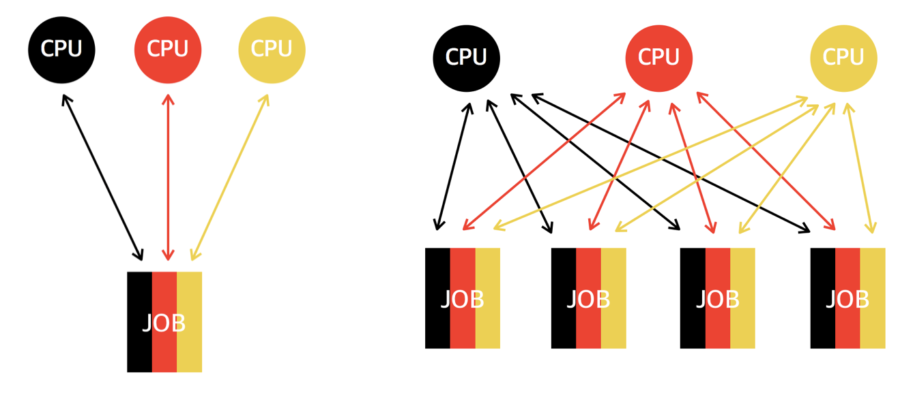

# 시분할 시스템, 멀티 태스킹, 멀티 프로세싱, 멀티 프로그래밍

## 시분할 시스템 

* 응용 프로그램이 CPU를 사용하는 시간을 잘 개 쪼개서, 여러 개의 응용 프로그램을 동시에 실행하는 기법
* 다중 사용자를 지원하고, 컴퓨터 응답 시간을 최소화하는 시스템

## 멀티 태스킹

* 두 가지 이상의 작업을 동시에 처리하는 것을 말한다.
* 멀티 태스킹은 꼭 멀티 프로세스를 뜻하지는 않는다. 한 프로세스 내에서 멀티 태스킹을 할 수 있도록 만들어진 애플리케이션들도 있다. 
  * ex) 메신저는 채팅 기능을 제공하면서 동시에 파일 전송 기능을 수행하기도 한다.
  * ex) 미디어 플레이어는 동영상 재생과 음악 재생이라는 두 작업을 동시에 처리한다.
* 하나의 cpu에 여러 프로세스를 처리하는데, 0.1초마다 cpu 실행을 바꿔가면서 실행하면 동시에 실행하는 것처럼 보인다. 

## 멀티 프로세싱

* 여러 cpu에서 하나의 응용 프로그램을 병렬로 실행하게 해서, 실행 속도를 높이는 기법
* 여러 개의 프로세스를 여러 대의 cpu를 활용해서 조금 조금씩 나눠 가져서 생산성을 높이기도 한다.

## 멀티 프로그래밍

* 최대한 cpu를 일정 시간당 많이 활용하는 시스템
