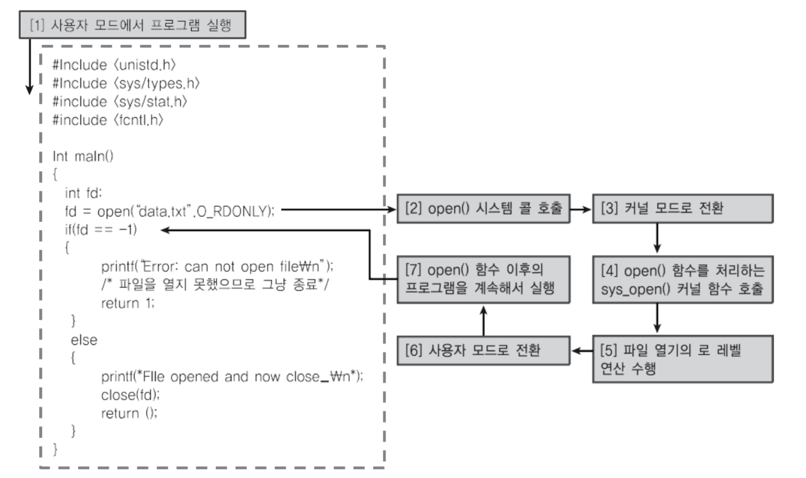

# 멀티 프로그래밍

* 최대한 cpu 를 많이 활용하도록 하는 시스템이다.
* 응용 프로그램은 온전히 cpu를 쓰기 보다, 다른 작업을 중간에 필요로 하는 경우가 많다.
  * 응용 프로그램이 실행되다가 파일을 읽는다.
    * 저장매체에서 파일을 읽기 전까지는, cpu 에 응용프로그램이 놓여있어도 아무 작업도 하지 않는다. 
  * 응용 프로그램이 실행되다가 프린팅을 한다.  
    * 프린팅이 끝날 때까지 응용프로그램은 아무 작업도 하지 않는다.

> 1. 라이브러리가 cpu 에 올라온다 (#include)
>
> 2. cpu 는 순차적으로 코드를 위에서부터 아래로 실행한다.
>
> 3. 저장매체에서 파일을 읽어오는 작업을 하는 동안에는, cpu 는 그 다음 줄로 넘어가지 못한다.
>
>    ➜ 이 시간은 cpu 입장에서 굉장히 버려지는 시간이기 때문에, 다른 응용프로그램을 실행하는 게 어떨까?

