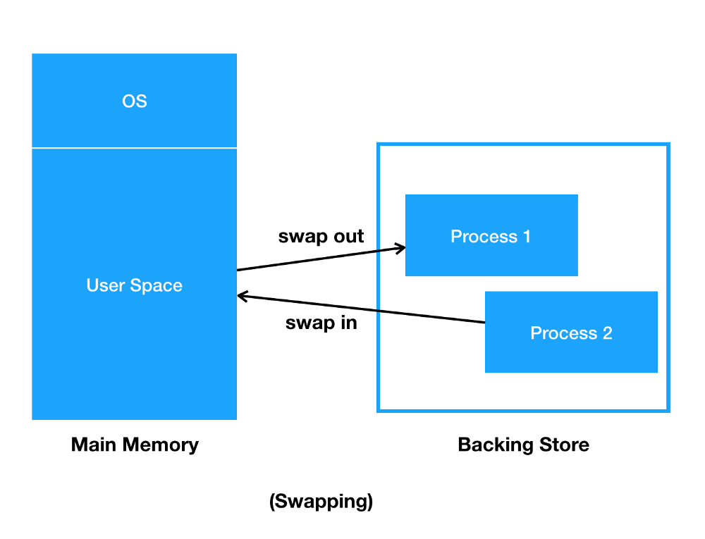

# 1. Redis 란? 

* In-Memory Data Structure Store
  * 디스크가 아닌, Main Memory 에 설치되어 운영되는 방식
* Supported data structures
  * Strings, set, hashes, list 등

# 2. Redis 의 등장 배경

### * Cache 의 개념

* Cache 는 나중에 요청올 결과를 미리 저장해두었다가 빠르게 서비스를 해주는 것을 의미
* Cache 를 쓰는 이유는 **접근 속도**가 빠르기 때문


* 아래로 갈수록 용량은 커지고, 위로 갈수록 속도는 빨라짐
* CPU Cache (SRAM)
  * 내 맥북의 경우 12GB SRAM
* Main Memory (DRAM) vs. Database (HDD, SSD)
  * Main Memory가 Database 보다 더 빠르므로, 이곳에다 더 자주 접근하는 데이터를 저장하자 ➜ Redis 의 등장
  * In-memory Database (Redis)


## 1) Cache 구조 

### 1-1) Look aside Cache

Lazy Loading (look aside 전략)


### 1-2) Write Back

* CPU 데이터를 사용할 때 데이터는 먼저 캐시로 기록되는데, 캐시 내에 일시적으로 저장된 후에 블록 단위에 캐시로부터 해제되는 때(캐시안에 있는 내용을 버릴시) 에만 주기억장치 또는 보조기억장치에 기록되는 방식이다. 
* 즉, 데이터를 쓸 때 메모리에는 쓰지 않고 캐시에만 업데이트를 하다가 필요할 때에만 주기억장치나 보조기억장치에 기록하는 방법이다.

### use-case

* log 를 DB 에 저장하는 경우, cache 에다가 넣었다가 한 번에 DB 에 넣는다.

# 3. Redis 의 Collection


## 3-1. 왜 Collection 이 중요한가

#### 1) 랭킹 서버를 직접 구현한다면?

* 가장 간단한 방법은?
  * DB 에 유저의 Score 를 저장하고 Score 로 order by 로 정렬 후 읽어오기
  * 개수가 많아지면 속도에 문제가 발생할 수 있음
    * 결국은 디스크를 사용하므로
* Redis 의 *Sorted Set* 을 이용하면, 랭킹을 구현 할 수 있음


#### 2) 친구 리스트를 KEY/VALUE 형태로 저장해야 한다면? 

* Redis 의 경우는 자료구조가 **Atomic** 하기 때문에, 해당 Race condition 을 피할 수 있다. ➜ Collection 이 있기 때문에 가능한 것
  * 그래도 잘못짜면 발생함.
  
  

#### 3) 그래서 왜 Collection 이 중요한가?

* 외부의 Collection 을 잘 이용하는 것으로, 여러가지 개발 시간을 단축시키고, 문제를 줄여줄 수 있기 때문에 Collection 이 중요.
  * 개발자는 비즈니스 로직에만 집중할 수 있게 해준다.


## 3-2. Redis Collection 종류

데이터 Collection 을 어떤 걸 선택하냐에 따라 서비스의 속도가 빨라지거나 느려질 수 있다. 보통 Strings 와 Sorted set 이 가장 많이 이용된다. 

### 1) Strings

* key-value 저장
* key를 어떻게 명명할것인가가 중요 
* 간단한 SQL 을 대체한다면? 
  * `Insert into users(name, email) values('gildong', 'gildong@naver.com');`
  * Using Set
    * `Set (name:gildong) (gildong)`
    * `Set (email:gildong) (gildong@naver.com)

### 2) List

* 맨 앞이나, 맨 뒤에 데이터를 넣는건 빠르나 중간에 데이터를 삽입해야 한다면 List 를 선택하면 안 된다.

* 기본 사용법 

  * `Lpush <key> <value>`

    * `LPOP <key>`

  * `Rpush <key> <value>`
    * `RPOP <key>`

### 3) Set

* 데이터가 있는 지 없는 지만 체크하는 용도 (중복 허용이 안되므로 unique 하게 저장됨)
* 기본 사용법
  * `SADD <key> <value>`
    * Value 가 이미 key 에 있으면 추가되지 않는다.
  * `SMEMBERS <key>`
    * 모든 Value 를 돌려준다.
  * `SISMEMBER <key> <value>`
    * value 가 존재하면 1, 없으면 0
* 사용 예 - 특정 유저를 Follow 하는 목록을 저장해두는 경우. 


### 4) Sorted Sets

* Set 은 순서가 없는데 Sorted Set은 *Score* 를 줘서 순서를 매길 수 있다.
* 기본 사용법
  * `ZADD <key> <score> <value>`
    * value 가 이미 key 에 있으면 해당 Score 로 변경된다.
  * `ZRANGE <key> <startIndex> <endIndex>`
    * 해당 Index 범위 값을 모두 돌려줌
    * `Zrange testkey 0 -1` : 모든 범위를 가져옴
* 유저 랭킹 보드로 사용할 수 있다.
* 이슈사항
  * Sorted sets 의 score 는 double 타입이기 때문에, 값이 정확하지 않을 수 있다.
  * 컴퓨터에서는 실수가 표현할 수 없는 정수값들이 존재

* 간단한 SQL 을 대체한다면? - 정렬된 값이 필요한 경우
  * `select * from rank order by score limit 50, 20;`
    * `zrange rank 50 70`
  * `select * from rank order by score desc limit 50, 20;`
    * `Zrevrange rank 50 70`

### 5) Hash

* key 밑에 sub key가 존재하는 형태
* 기본 사용법
  * `Hmset <key> <subkey1> <value1> <subkey2> <value2>`
  * `Hgetall <key>`
    * 해당 key 의 모든 subkey 와 value 를 가져온다.
  * `Hget <key> <subkey>`
  * `Hmget <key> <subkey1> <subkey2> ... <subkeyN>`
* 간단한 SQL 을 대체한다면?
  * `Insert into users(name, email) values ('gildong', 'gildong@naver.com');`
  * `hmset gildong_info name gildong email gildong@naver.com


### ※ Collection 주의 사항

* 하나의 컬렉션에 너무 많은 아이템을 담으면 좋지 않음
  * 10000개 이하 수준으로 유지하는게 좋음
* Expire 는 Collection 의 item 개별로 걸리지 않고 전체 Collection 에 대해서만 걸림
  * 즉, 해당 10000 개의 아이템을 가진 Collection 에 expire 가 걸려있다면 그 시간 후에 10000 개의 아이템이 모두 삭제된다.


### 3-3. Java 에도 HashMap 이 있는데 그걸 쓰면 되지 않는가?

```java
// 여기다가 저장해도 Memory Database 개념인건데 왜 이거를 안 쓸까?
priavate final Map<String, Object> memory = new HashMap<>();
```

* 서버가 여러대인 경우, 서버마다 다른 데이터를 가지고 있기 때문에 Consistency 의 문제가 발생한다.
  * ex. 세션을 Java 객체에 저장하면, 다른 서버에서는 해당 세션이 없기 때문에 Consistency 문제가 발생한다.
* Multi-Threaded 환경에서 Race Condition 이 발생한다.


### ※ Race Condition

**Race Condition** 이란 여러 개의 Thread가 경합하는 것이다. Context Switching 에 따라 원하지 않는 결과가 발생할 수 있다.


### 3-4. Redis 는 Race Condition 을 어떤 식으로 해결하는가?

* Redis 는 기본적으로 Single Threaded 이기 때문에 Race Condition 을 막을 수 있다.

* Redis의 자료구조는 Atomic한 성질을 가지고 있어서 Critical Section 에 대한 동기화를 제공

  * Critical Section - 프로세스가 동시에 접근하면 안 되는 영역 
  * 여러 Transaction 들이 Read/Write 를 동기화함으로써, 원치 않는 결과를 막아주는 기본적인 구현이 Redis 자료구조에 되어있다. 

  


# 4. Redis 는 어디에 쓰는가?

### 여러 서버에서 같은 데이터를 공유하고 싶을 때


### ⇢ Single Server 라면, 전역 변수를 쓰면 되지 않을까?

* Redis 자료구조는 Atomic 을 보장해주기 때문에 Atomic 한 자료구조를 쓰기 위해서 쓸 수 있다. 
*  Cache 기능을 사용하기 위해서 쓸 수 있다.


### 주로 많이 쓰는 곳들

* 인증 토큰 등을 저장 (Strings 또는 hash)
* Ranking 보드로 사용 (Sorted Set)
* 유저 API Limit
* 잡 큐 (list)

# 5. Redis 운영 시, 주의할 점 

>1. In-memory 특성상 메모리 파편화, 가상 메모리등의 이해가 필요하다.
>2. Single Thread 서버 이므로 시간 복잡도를 고려해야 한다.


## 5-1. 메모리 관리

메모리를 많이 쓰면 Redis 가 죽는 경우가 발생한다.

### 1) Memory 파편화

메모리를 할당 받고 해제하는 과정에서 생기는 비어있는 공간 ➜ 사용하지 못하는 공간이 생기게 된다.

이 과정에서 프로세스가 죽는 현상이 발생할 수 있다. Redis 를 사용할 때는 메모리를 여유있게 사용하는게 좋다.

* https://aws.amazon.com/ko/elasticache/pricing/?nc=sn&loc=4


### 2) 가상 메모리의 Swap

프로세스를 메모리에 올릴 때, 전체 프로세스를 올리는 게 아니라 일부만 올려서 메모리에서 사용하고 덜 쓰이는 프로세스의 메모리는 disk 에 저장하는 방식이다. 이 과정에서 latency 가 발생하고, 그 latency 가 길어진다면 Redis의 경우 Single Thread 환경이기 때문에 문제가 발생할 여지가 있다. ➜ swap 에 대한 배경지식도 필요. swap 을 쓸 지, 안 쓸 지도 선택을 해야 한다.




### 3) Replication - Fork

Redis 는 휘발성인 메모리 저장소 ➜ 데이터가 유실될 가능성이 있기 때문에 복사 기능을 제공한다. 

`Fork` 연산 : 데이터를 복사해서 Slave의 Redis 서버 혹은 disk 로 전송해서 저장하는 방식이다.  Process 를 메모리상에서 복제하므로 이 과정에서 메모리가 가득 차 있다면 복사본이 제대로 생성되지 않고 서버가 죽는 현상이 발생한다. 


#### Redis Replication 설정 과정

* Secondary 에 `replicaof` or `slaveof` 명령어 전달 (master의 ip, host 전달)
* Secondary 는 Primary 에 sync 명령 전달
* Primary 는 현재 메모리 상태를 저장하기 위해 `Fork` 를 함 
* `Fork` 한 프로세서는 현재 메모리 정보를 disk 에 dump
* 해당 정보를 secondary 에 전달
* Fork 이후의 데이터를 secondary 에 계속 전달하면서 Replication 이 일어남


## 5-2. Single Thread 서버 이므로 시간 복잡도를 고려해야 한다. *O(N)* 주의!

Redis 는 네트워크로부터 요청을 받아서 명령을 처리하는데 ... 

#### Packet 으로 하나의 Command 가 완성되면 processCommand 에서 실제로 실행됨


➜ Single Thread 이므로 빨리빨리 처리해야 한다. 그러므로 전체 데이터를 다루는 O(N) 시간복잡도를 가지는 명령어는 주의하자.

ex. 모든 데이터를 다루는 명령어는 주의하자. *keys, FlushAll, GetAll*


* 삭제가 되어도 문제가 없는 데이터에 대해서만 Redis 로 활용해야 한다.

* key-value 로 이루어지는 간단한 데이터에 대해서만 Redis 로 이용한다. 

* Redis 사용사례

  1) 웹페이지 캐싱 

  2) 세션 서버로 이용

  * 회원 로그인 이후, 생성되는 Session 은 서버 즉, 백엔드에서 생성되고 관리된다. 이걸 디스크에 저장하게 되면 접근속도가 느리게 되지만 Redis 처럼 인메모리 캐시상에서 관리하게 되면 퍼포먼스가 더 좋아진다. 또한, Session 정보를 Redis 에 저장할 수 있는 이유는 초기화 되어도 문제가 없는 데이터이기 때문이다.
  * 세션서버를 따로 두면, 서버간의 세션 공유도 가능하다.

  * 채팅 구현할 때 세션 서버를 따로 두는 경우도 있다.

  

  

  

---

## 1. Redis 설치

* Redis 는 리눅스 쪽에서 많이 지원이 되다 보니, 로컬에다 Redis를 설치하는 방법보다는 주로 도커를 이용한다.


### (1) 로컬에 Redis 설치하는 방법

```shell
# 반드시 공식문서 참고할 것
$ wget http://download.redis.io/redis-stable.tar.gz
tar xvzf redis-stable.tar.gz
$ cd redis-stable
# 운영체제마다 다르게 build 되어진다.
$ make

# redis cli 를 다운받자
$ brew install redis

# redis 다운받은 위치로 가서 (. ~/redis-stable) redis 실행
$ redis-server
```


### (2) Docker 로 설치하는 방법

```shell
# 6379 포트로 redis 를 열겠다.(run명령어는 container 를 생성하고 실행함)
$ docker run -p 6379:6379 redis
```

 


## 2. Redis CLI 를 이용해 실습해보기

>  Redis 의 데이터 타입
>
> * Strings
> * Lists
> * Sets
> * Hashes


```shell
# redis 의 container ID 를 확인하자
$ docker ps

# 해당 컨테이너로 접속하라
$ docker exec -it 컨테이너ID /bin/bash

# redis 에 접속
$ redis cli
```


(1) get, set

```shell
> set a 10
> get a
> expire a 10 
> ttl a
# 10초 후에 a값을 가져오지 못한다. 
> get a 
```


(2) keys

```shell
# 어떤 변수들이 있나 보고 싶을 때
> keys *
# ch가 들어간 key를 찾아라
> keys *ch* 
```


(3) *List* 자료구조 이용하기

* 중복 허용

```shell
# 왼쪽에 2를 넣어라 
> lpush num_lists 2
# 0부터 모든 위치의 값을 조회하라
> lrange num_lists 0 -1
```


(4) *Set* 자료구조 이용하기

* 중복 불가

```shell
> sadd num_sets 1
> sadd num_sets 2
> sadd num_sets 3
> sadd num_sets 3
> smembers num_sets
```


(5) *Hash* 자료구조 이용하기

아래의 객체 데이터 구조로 Hash 에다가 넣어보자.

```json
fruit : {
  orange: 2000,
  apple: 1000
}
```


```shell
> hmset fruit orange 2000 apple 1000
> hmget fruit orange
> hmget fruit orange apple
```


## (3) Node.js 와 Redis 연동하기

실습 : `study > node > redis-study-2` 폴더 확인


----

## Monitoring Factor

* Connection 수 - 클라이언트 명령 보내고 접속 끊고를 반복 ?
  * Redis 는 싱글스레드라서, 커넥션 맺고 끝는데만 많이 쓰여서 성능이 떨어짐

## CPU가 100%를 칠 경우

* 처리량이 매우 많다면?
  * 좀 더 CPU 성능이 좋은 서버로 이전
  * 실제 CPU 성능에 영향을 받음
    * 그러나 단순 get/set은 초당 10만 이상 처리 가능

* O(N) 계열의 특정 명령이 많은 경우
  * Monitor 명령을 통해 특정 패턴을 파악하는 것이 필요
    * Monitor 명령어 ➜ 현재 쓰고 있는 명령어들이 쭉 나옴
    * Monitor 잘못쓰면 부하로 해당 서버에 더 큰 문제를 일으킬 수도 있음 (짧게 쓰는게 좋음)

---

### 출처

* https://www.youtube.com/watch?v=mPB2CZiAkKM&t=3197s

* https://fastcampus.co.kr/courses/201760/clips/
