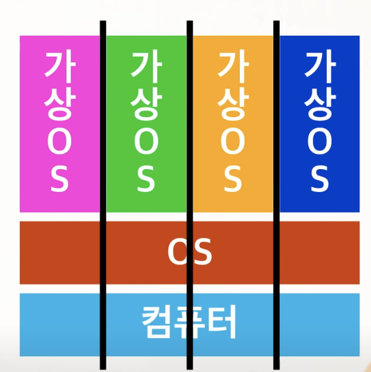
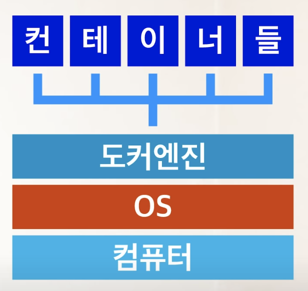

# Docker 란

### 도커는 가상 컴퓨팅하고는 다른 구조이다

* 가상컴퓨팅은 한 물리적 컴퓨터 안에 각각 os를 가동하는 가상 컴퓨터들이 물리적 자원을 분할해서 쓰기 때문에 성능상에 한계가 있다.

* 도커는 OS 단까지 내려가는게 아니라 **실행환경만 독립적으로 돌리는 거라서** 컴퓨터에 직접 요소들을 설치한거랑 별 차이 없는 성능을 낼 수 있다.
* 버전 업그레이드 등을 해야 하는 경우 컨테이너만 통째로 교체하면 된다.

